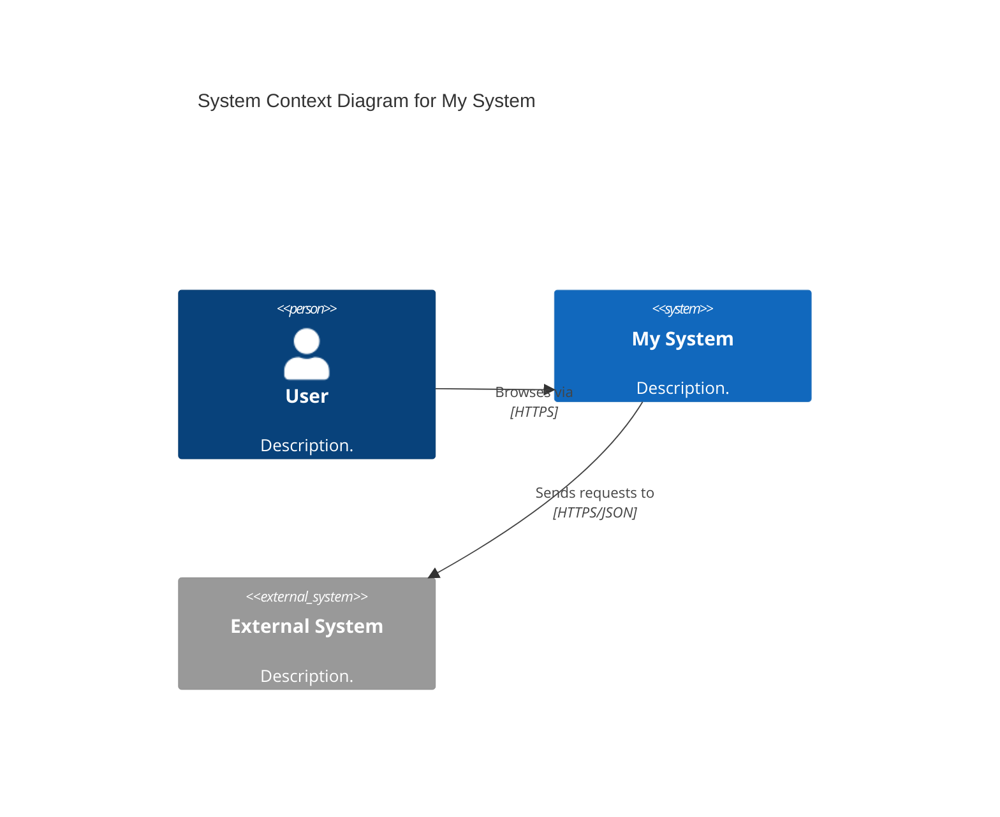
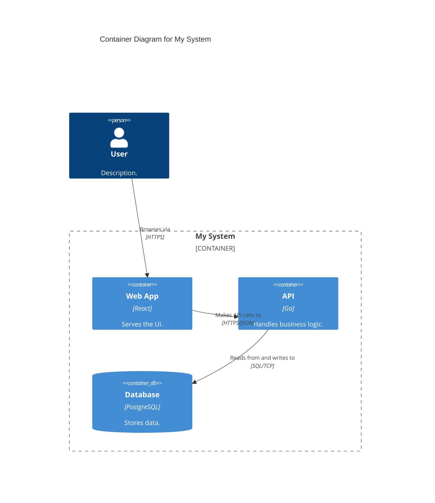

# Creating C4 Diagrams

This skill is C4-specific: model architecture using C4 abstractions and notation (not generic box-and-arrow diagrams).

## Workflow: Creating a C4 diagram

1. **Identify the audience and scope.** Determine which diagram level is needed:
   - **Level 1 — System Context**: How the system fits into the world. Always create this first.
   - **Level 2 — Container**: Major technical building blocks and communication. Always create this second.
   - **Level 3 — Component**: Internal structure of a single container. Create only when it adds value.
   - **Dynamic**: Runtime behavior for a specific use case. Create for complex or non-obvious flows.
   - **Deployment**: How containers map to infrastructure. Create for production systems.
   - Skip Level 4 (Code) — auto-generate from IDE instead.

2. **Choose the tool.**
   - **Default: Structurizr DSL** — model-first, single model with multiple views, supports all diagram types. Use for any long-lived architecture documentation.
   - **Alternative: Mermaid** — use only for quick diagrams in Markdown files (READMEs, PRs, wikis). Limited to Context and Container levels; no dynamic or deployment diagrams.

3. **Identify the elements.** Map the system to C4 abstractions:
   - **Person**: A human user role.
   - **Software System**: A top-level system owned and deployed by one team.
   - **Container**: A separately deployable/runnable unit (app, database, queue, function). NOT a Docker container.
   - **Component**: A module/package within a container. Not separately deployable.
   - Apply the test: *"Does this need to be running for the system to work?"* → Yes = Container. No = Component.

4. **Define relationships.** Every arrow must have:
   - A **specific action verb** label: *"Submits purchase orders to"*, *"Reads customer records from"*, *"Publishes OrderCreated events to"*
   - A **technology annotation** for inter-process communication: `HTTPS/JSON`, `gRPC`, `SQL/TCP`, `AMQP`
   - **Unidirectional direction only** — never use bidirectional arrows. Draw two separate arrows instead.
   - Use the pattern: `[Action verb] + [what] + [preposition]`
   - Avoid weak verbs: Uses, Calls, Connects, Talks, Accesses.

5. **Write the diagram code.** Follow these rules:
   - Every element gets: name, type label, technology (containers/components), one-sentence responsibility.
   - Every diagram gets: title describing type and scope, key/legend, max ~20 elements.
   - Tag external systems with `"External"`. Use `tags` for styling, not per-element styles.
   - In Structurizr DSL: always use `!identifiers hierarchical`.
   - In Mermaid: use `C4Context` or `C4Container` as diagram type.

6. **Validate against the review checklist.** Check all items in [references/08-checklists.md](references/08-checklists.md).

## Workflow: Reviewing an existing C4 diagram

1. **Check abstraction correctness:**
   - Are containers actually separately deployable? (shared libraries are components, not containers)
   - Are system boundaries aligned with team ownership?
   - Is the message broker modeled as individual topics/queues, not a single hub?
   - Are external systems shown as opaque boxes without internal details?

2. **Check notation quality:**
   - Does every element have a name, type label, technology, and description?
   - Are all arrows unidirectional with specific action-verb labels?
   - Are communication protocols specified on inter-process arrows?
   - Is there a title, legend, and ≤20 elements?

3. **Check for common anti-patterns:** vague "Uses"/"Calls" labels, bidirectional arrows, missing type metadata, color as only differentiator, 30+ elements in one diagram, invented abstraction levels. See [references/03-anti-patterns.md](references/03-anti-patterns.md) for the full catalog.

4. **Propose specific fixes** with corrected code.

## Workflow: Using C4 diagrams as context

When C4 diagrams are available in the project (`.dsl` files or Mermaid blocks), use them as architectural context for:

- **Design decisions**: Reference the container diagram to understand system boundaries and communication patterns before proposing changes.
- **Code generation**: Use component diagrams to understand module responsibilities and interfaces when generating implementation code.
- **Risk analysis**: Walk the container diagram to identify security boundaries, data flows, and single points of failure. See [references/05-adr-and-risk-modeling.md](references/05-adr-and-risk-modeling.md).
- **Onboarding explanations**: Start with Level 1 (context), then zoom into Level 2 (containers) to explain system architecture.
- **ADR context**: Link architectural decisions to specific C4 elements. Reference ADRs in element descriptions.

## Structurizr DSL quick reference

```
workspace "Name" "Description" {
    !identifiers hierarchical

    model {
        user = person "User" "Description."
        system = softwareSystem "System" "Description." {
            webapp = container "Web App" "Description." "React"
            api = container "API" "Description." "Go"
            db = container "Database" "Description." "PostgreSQL" { tags "Database" }
        }
        ext = softwareSystem "External" "Description." { tags "External" }

        user -> system.webapp "Browses via" "HTTPS"
        system.webapp -> system.api "Makes API calls to" "HTTPS/JSON"
        system.api -> system.db "Reads from and writes to" "SQL/TCP"
        system.api -> ext "Sends requests to" "HTTPS/JSON"
    }

    views {
        systemContext system "Context" { include *; autoLayout }
        container system "Containers" { include *; autoLayout }
        styles {
            element "Person" { shape person }
            element "Database" { shape cylinder }
            element "External" { background #999999; color #ffffff }
        }
    }
}
```

## Mermaid quick reference





## Key decisions

- **Microservices owned by one team** → model as containers within one software system.
- **Microservices owned by separate teams** → promote each to its own software system.
- **Event-driven** → model individual topics/queues as containers, not the broker.
- **Serverless functions** → model as containers (they are separately deployable).
- **Component diagrams** → create only for complex containers; skip for simple microservices.

## Reference material

- **Fundamentals and abstractions**: [references/01-fundamentals-and-abstractions.md](references/01-fundamentals-and-abstractions.md)
- **Notation and styling**: [references/02-notation-and-styling.md](references/02-notation-and-styling.md) — relationship label pattern library
- **Anti-patterns**: [references/03-anti-patterns.md](references/03-anti-patterns.md) — common mistakes and fixes
- **Tooling and diagram-as-code**: [references/04-tooling-and-diagram-as-code.md](references/04-tooling-and-diagram-as-code.md) — Structurizr DSL, Mermaid, workspace modularization
- **ADR and risk modeling**: [references/05-adr-and-risk-modeling.md](references/05-adr-and-risk-modeling.md) — ADR integration, risk-storming, STRIDE
- **Modern patterns and adoption**: [references/06-modern-patterns-and-adoption.md](references/06-modern-patterns-and-adoption.md) — microservices, event-driven, serverless, DDD, team playbook
- **Worked example**: [references/07-worked-example.md](references/07-worked-example.md) — complete PageTurn bookstore from L1 through deployment
- **Checklists**: [references/08-checklists.md](references/08-checklists.md) — diagram review, abstraction guide, tool selection
