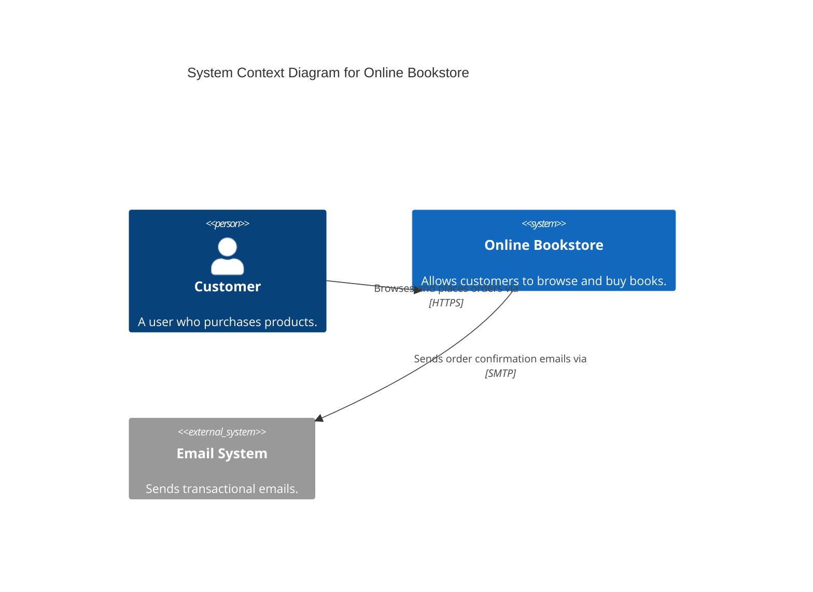
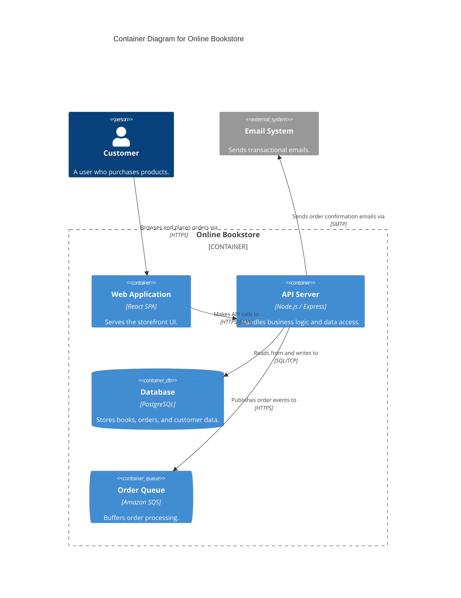

# C4 Tooling and Diagram-as-Code

## Tooling Ecosystem

### Tool Categories

| Category | Examples | Model semantics | Version control | Audience |
|----------|----------|----------------|-----------------|----------|
| **Traditional diagramming** | draw.io, Miro, Lucidchart, Excalidraw | None | Difficult (binary formats) | Anyone |
| **Diagram-as-code** | Mermaid, c4builder | None (each diagram standalone) | Excellent (text files) | Developers |
| **Model-as-code** | Structurizr DSL, C4InterFlow, Overarch | Full (single model, multiple views) | Excellent (text files) | Developers, architects |
| **Visual modeling** | IcePanel, Archi, Isoflow | Full (GUI-based model) | Varies | Mixed teams |

### Key Distinction: Diagramming vs. Modeling

**Diagramming tools** (including diagram-as-code): Each diagram is standalone. If you rename a container, you must update every diagram manually. No validation, no shared model, duplication across diagrams.

**Modeling tools** (including model-as-code): You define the model once — elements, relationships, and their metadata. Then you create views (diagrams) on top of the model. Rename a container in the model, and every view updates automatically. The tool can validate consistency and prevent errors.

**Simon Brown's recommendation**: Use a model-first approach. Define the model in Structurizr DSL, then export to any rendering engine (Mermaid, D3.js, etc.).

### Structurizr DSL vs. Mermaid

| Aspect | Structurizr DSL | Mermaid |
|--------|----------------|---------|
| **Type** | Modeling tool | Diagramming tool |
| **Single model, multiple views** | Yes | No (each diagram is independent) |
| **C4 level support** | All levels + supplementary | Context + Container only |
| **Deployment diagrams** | Full support | Limited |
| **Dynamic diagrams** | Full support | Not supported |
| **GitHub/GitLab rendering** | Via export to Mermaid/SVG | Yes (native Markdown rendering) |
| **Layout control** | Auto-layout + manual positioning | Limited |
| **Interactive diagrams** | Yes (Structurizr UI) | No |
| **Runtime requirement** | Java CLI or Docker | JavaScript (browser) |
| **Learning curve** | Medium (custom DSL) | Low (Markdown-like) |
| **Best for** | Long-lived architecture docs, multi-team orgs | Quick diagrams in docs/READMEs |

---

## Structurizr DSL

Structurizr DSL is the purpose-built DSL for C4 models by Simon Brown. It defines a model and views in a single workspace file.

**Workspace structure**:

```
workspace "System Name" "Optional description" {

    !identifiers hierarchical

    model {
        // People
        customer = person "Customer" "A user who purchases products."

        // External systems
        emailSystem = softwareSystem "Email System" "Sends transactional emails." {
            tags "External"
        }

        // Your system
        bookstore = softwareSystem "Online Bookstore" "Allows customers to browse and buy books." {
            webapp = container "Web Application" "Serves the storefront UI." "React SPA"
            api = container "API Server" "Handles business logic and data access." "Node.js / Express"
            db = container "Database" "Stores books, orders, and customer data." "PostgreSQL" {
                tags "Database"
            }
            queue = container "Order Queue" "Buffers order processing." "Amazon SQS" {
                tags "Queue"
            }
        }

        // Relationships
        customer -> bookstore.webapp "Browses and places orders via" "HTTPS"
        bookstore.webapp -> bookstore.api "Makes API calls to" "HTTPS/JSON"
        bookstore.api -> bookstore.db "Reads from and writes to" "SQL/TCP"
        bookstore.api -> bookstore.queue "Publishes order events to" "HTTPS"
        bookstore.api -> emailSystem "Sends order confirmation emails via" "SMTP"
    }

    views {
        systemContext bookstore "SystemContext" {
            include *
            autoLayout
        }

        container bookstore "Containers" {
            include *
            autoLayout
        }

        styles {
            element "Person" {
                shape person
            }
            element "Database" {
                shape cylinder
            }
            element "Queue" {
                shape pipe
            }
            element "External" {
                background #999999
                color #ffffff
            }
        }
    }
}
```

**Key practices**:

- **Use `!identifiers hierarchical`** — scopes identifiers within parent elements, preventing naming collisions in large models.
- **Use `!include`** — split large workspaces across files. One file per team or per domain.
- **Store in version control** alongside source code. Architecture changes are reviewed in the same PR as code changes.
- **Use tags** for styling — apply visual styles via tags rather than per-element, ensuring consistency.
- **Use groups** for visual clustering within diagrams:
  ```
  group "Payment Domain" {
      paymentApi = container "Payment API" ...
      paymentDb = container "Payment DB" ...
  }
  ```
- **Integrate ADRs**: `!adrs docs/adrs` links Architecture Decision Records directly into the workspace.
- **Run locally**: `docker run -p 8080:8080 -v ./workspace:/usr/local/structurizr structurizr/lite`
- **CI/CD integration**: Use the Structurizr GitHub Action to auto-publish on push.
- **Cloud themes**: Use `!theme amazon-web-services-2020.04.30` for AWS icons in deployment diagrams.

---

## Mermaid

Mermaid has built-in C4 support for Context and Container diagrams. It renders natively in GitHub, GitLab, and many documentation tools.

**System Context example**:



**Container Diagram example**:



**Key practices**:

- Use `C4Context`, `C4Container`, or `C4Component` as the diagram type.
- Mermaid's C4 support is more limited than Structurizr — no deployment diagrams, no dynamic diagrams.
- Best suited for quick diagrams embedded directly in Markdown files (READMEs, wikis, PR descriptions).
- Layout control is minimal — accept auto-layout or switch to Structurizr for complex diagrams.

---

## Workspace Modularization with `!include`

As your architecture grows beyond a single team, a monolithic workspace file becomes a bottleneck. Structurizr DSL's `!include` directive lets you split a workspace across multiple files.

### How `!include` Works

The `!include` keyword inlines the contents of another file (or all `.dsl` files in a directory) into the parent document. Supported sources:

```
!include people.dsl              # single file (relative path)
!include model/payments/         # all .dsl files in a directory (alphabetical order)
!include https://example.com/shared-systems.dsl  # remote file via HTTPS
```

Key constraint: included files must be in the same directory or a subdirectory of the parent file. No `../` parent directory references.

### Pattern 1: Split by Domain / Bounded Context

```
workspace/
├── workspace.dsl            # root — includes everything
├── shared/
│   ├── people.dsl           # shared person definitions
│   └── external-systems.dsl # third-party system definitions
├── catalog/
│   ├── model.dsl            # catalog domain model + relationships
│   └── views.dsl            # catalog-specific views
├── orders/
│   ├── model.dsl            # order domain model + relationships
│   └── views.dsl            # order-specific views
└── platform/
    ├── model.dsl            # shared infrastructure (API gateway, message broker)
    └── views.dsl            # platform views
```

### Pattern 2: Split by Abstraction Layer

```
workspace/
├── workspace.dsl
├── model/
│   ├── people.dsl
│   ├── systems.dsl
│   ├── containers.dsl
│   ├── components.dsl
│   └── relationships.dsl
└── views/
    ├── context-views.dsl
    ├── container-views.dsl
    ├── component-views.dsl
    └── deployment-views.dsl
```

### Pattern 3: Directory-Based Auto-Include

```
model {
    !include shared/
    !include domains/
}
```

Name files with numeric prefixes (`01-people.dsl`, `02-external-systems.dsl`) to control ordering.

### Critical Rules

1. **No forward references.** Elements must be defined before any relationship references them.
2. **Use `!identifiers hierarchical`** in the root workspace to prevent naming collisions.
3. **Keep relationships close to their source.** Define intra-domain relationships in the domain's `model.dsl`.
4. **Each included file should be independently understandable.**
