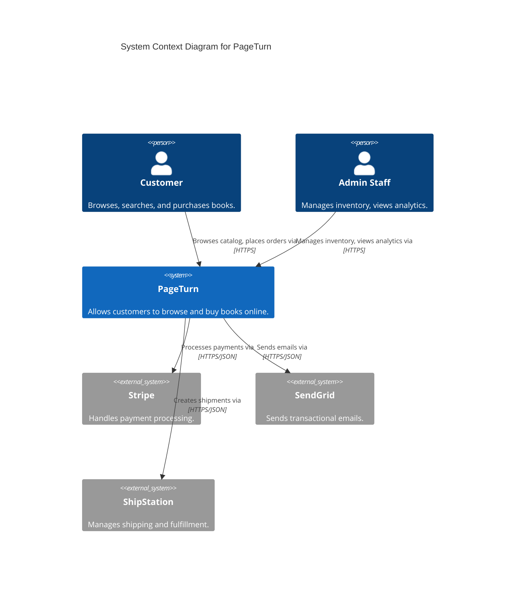
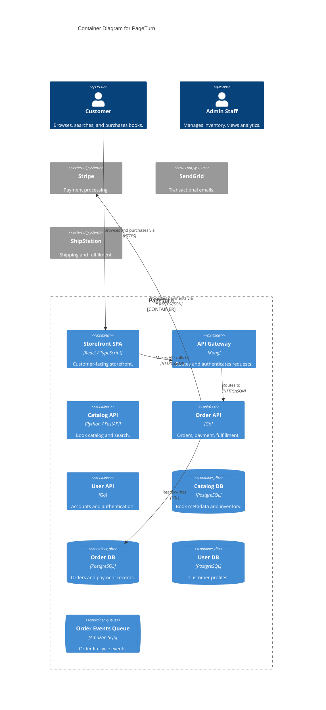

# Worked Example: Online Bookstore (PageTurn)

This models a complete system from Level 1 through deployment using Structurizr DSL (primary) and Mermaid (alternative).

## System Description

PageTurn is an online bookstore where customers can browse a catalog, search for books, place orders, and track deliveries. It integrates with Stripe (payments), SendGrid (email), and ShipStation (shipping). An admin panel lets staff manage inventory and view analytics.

## Level 1: System Context

### Structurizr DSL

```
workspace "PageTurn" "Online Bookstore Architecture" {

    !identifiers hierarchical

    model {
        customer = person "Customer" "Browses, searches, and purchases books."
        admin = person "Admin Staff" "Manages inventory, views analytics."

        pageturn = softwareSystem "PageTurn" "Allows customers to browse and buy books online." {
            // Containers defined at Level 2
        }

        stripe = softwareSystem "Stripe" "Handles payment processing." { tags "External" }
        sendgrid = softwareSystem "SendGrid" "Sends transactional emails." { tags "External" }
        shipstation = softwareSystem "ShipStation" "Manages shipping and fulfillment." { tags "External" }

        customer -> pageturn "Browses catalog, places orders via" "HTTPS"
        admin -> pageturn "Manages inventory, views analytics via" "HTTPS"
        pageturn -> stripe "Processes payments via" "HTTPS/JSON"
        pageturn -> sendgrid "Sends emails via" "HTTPS/JSON"
        pageturn -> shipstation "Creates shipments via" "HTTPS/JSON"
    }

    views {
        systemContext pageturn "Level1_SystemContext" {
            include *
            autoLayout
        }
        styles {
            element "Person" { shape person }
            element "External" { background #999999; color #ffffff }
        }
    }
}
```

### Mermaid



---

## Level 2: Container Diagram

### Structurizr DSL

```
pageturn = softwareSystem "PageTurn" "Allows customers to browse and buy books online." {
    spa = container "Storefront SPA" "Customer-facing storefront." "React / TypeScript"
    adminApp = container "Admin Panel" "Staff dashboard." "React / TypeScript"
    apiGateway = container "API Gateway" "Routes and authenticates requests." "Kong"
    catalogApi = container "Catalog API" "Manages book catalog, search, recommendations." "Python / FastAPI"
    orderApi = container "Order API" "Handles order creation, payment, fulfillment." "Go"
    userApi = container "User API" "Manages accounts and authentication." "Go"
    catalogDb = container "Catalog DB" "Book metadata, categories, inventory." "PostgreSQL" { tags "Database" }
    orderDb = container "Order DB" "Orders, payment records, shipment tracking." "PostgreSQL" { tags "Database" }
    userDb = container "User DB" "Customer profiles and credentials." "PostgreSQL" { tags "Database" }
    searchIndex = container "Search Index" "Full-text search over book catalog." "Elasticsearch" { tags "Database" }
    orderQueue = container "Order Events Queue" "Buffers order lifecycle events." "Amazon SQS" { tags "Queue" }
    cache = container "Cache" "Caches catalog data and session state." "Redis" { tags "Database" }
}

customer -> pageturn.spa "Browses and purchases books via" "HTTPS"
admin -> pageturn.adminApp "Manages inventory via" "HTTPS"
pageturn.spa -> pageturn.apiGateway "Makes API calls to" "HTTPS/JSON"
pageturn.adminApp -> pageturn.apiGateway "Makes API calls to" "HTTPS/JSON"
pageturn.apiGateway -> pageturn.catalogApi "Routes catalog requests to" "HTTPS/JSON"
pageturn.apiGateway -> pageturn.orderApi "Routes order requests to" "HTTPS/JSON"
pageturn.apiGateway -> pageturn.userApi "Routes user requests to" "HTTPS/JSON"
pageturn.catalogApi -> pageturn.catalogDb "Reads from and writes to" "SQL/TCP"
pageturn.catalogApi -> pageturn.searchIndex "Indexes and queries books via" "HTTPS/JSON"
pageturn.catalogApi -> pageturn.cache "Caches catalog responses in" "Redis protocol"
pageturn.orderApi -> pageturn.orderDb "Reads from and writes to" "SQL/TCP"
pageturn.orderApi -> pageturn.orderQueue "Publishes order events to" "HTTPS"
pageturn.userApi -> pageturn.userDb "Reads from and writes to" "SQL/TCP"
pageturn.orderApi -> stripe "Processes payments via" "HTTPS/JSON"
pageturn.orderApi -> sendgrid "Sends order confirmation emails via" "HTTPS/JSON"
pageturn.orderApi -> shipstation "Creates shipping labels via" "HTTPS/JSON"
```

### Mermaid



---

## Level 3: Component Diagram (Order API)

### Structurizr DSL

```
orderApi = container "Order API" "Handles order creation, payment, and fulfillment." "Go" {
    orderController = component "Order Controller" "Handles HTTP requests." "Go / net/http"
    orderService = component "Order Service" "Orchestrates order lifecycle." "Go"
    paymentAdapter = component "Payment Adapter" "Integrates with Stripe." "Go"
    shippingAdapter = component "Shipping Adapter" "Integrates with ShipStation." "Go"
    emailAdapter = component "Email Adapter" "Integrates with SendGrid." "Go"
    orderRepository = component "Order Repository" "Data access for order persistence." "Go"
    eventPublisher = component "Event Publisher" "Publishes order lifecycle events." "Go"
}

pageturn.apiGateway -> pageturn.orderApi.orderController "Routes order requests to" "HTTPS/JSON"
pageturn.orderApi.orderController -> pageturn.orderApi.orderService "Delegates to"
pageturn.orderApi.orderService -> pageturn.orderApi.paymentAdapter "Processes payments via"
pageturn.orderApi.orderService -> pageturn.orderApi.shippingAdapter "Creates shipments via"
pageturn.orderApi.orderService -> pageturn.orderApi.emailAdapter "Sends confirmation emails via"
pageturn.orderApi.orderService -> pageturn.orderApi.orderRepository "Persists orders via"
pageturn.orderApi.orderService -> pageturn.orderApi.eventPublisher "Publishes order events via"
pageturn.orderApi.orderRepository -> pageturn.orderDb "Reads from and writes to" "SQL/TCP"
pageturn.orderApi.eventPublisher -> pageturn.orderQueue "Publishes events to" "HTTPS"
pageturn.orderApi.paymentAdapter -> stripe "Processes payments via" "HTTPS/JSON"
pageturn.orderApi.shippingAdapter -> shipstation "Creates shipping labels via" "HTTPS/JSON"
pageturn.orderApi.emailAdapter -> sendgrid "Sends emails via" "HTTPS/JSON"
```

> **Note**: Mermaid supports `C4Component` but with limited features. For component diagrams, prefer Structurizr DSL.

---

## Dynamic Diagram: Order Placement Flow

### Structurizr DSL

```
dynamic pageturn "OrderPlacement" "Sequence when a customer places an order." {
    customer -> pageturn.spa "Clicks 'Place Order'"
    pageturn.spa -> pageturn.apiGateway "POST /api/orders"
    pageturn.apiGateway -> pageturn.orderApi "Routes request"
    pageturn.orderApi -> pageturn.userApi "Validates customer session"
    pageturn.orderApi -> pageturn.catalogApi "Verifies book availability"
    pageturn.orderApi -> stripe "Charges payment"
    pageturn.orderApi -> pageturn.orderDb "Persists order record"
    pageturn.orderApi -> pageturn.orderQueue "Publishes OrderCreated event"
    pageturn.orderApi -> sendgrid "Sends order confirmation email"
    pageturn.orderApi -> shipstation "Creates shipping label"
    autoLayout
}
```

> **Note**: Mermaid does not support C4 dynamic diagrams. Use Structurizr DSL.

---

## Deployment Diagram: Production Environment

### Structurizr DSL

```
model {
    production = deploymentEnvironment "Production" {
        deploymentNode "AWS" "Amazon Web Services" "us-east-1" {
            deploymentNode "CloudFront" "CDN" "AWS CloudFront" {
                containerInstance pageturn.spa
                containerInstance pageturn.adminApp
            }
            deploymentNode "ECS Cluster" "Container Orchestration" "AWS ECS / Fargate" {
                deploymentNode "Catalog Service" "ECS Service" "2 tasks" {
                    containerInstance pageturn.catalogApi
                }
                deploymentNode "Order Service" "ECS Service" "2 tasks" {
                    containerInstance pageturn.orderApi
                }
                deploymentNode "User Service" "ECS Service" "2 tasks" {
                    containerInstance pageturn.userApi
                }
            }
            deploymentNode "RDS" "Managed Database" "AWS RDS" {
                deploymentNode "Catalog DB" "db.r6g.large" "Multi-AZ" {
                    containerInstance pageturn.catalogDb
                }
                deploymentNode "Order DB" "db.r6g.large" "Multi-AZ" {
                    containerInstance pageturn.orderDb
                }
                deploymentNode "User DB" "db.r6g.large" "Multi-AZ" {
                    containerInstance pageturn.userDb
                }
            }
            deploymentNode "ElastiCache" "Managed Redis" "AWS ElastiCache" {
                containerInstance pageturn.cache
            }
            deploymentNode "SQS" "Managed Queue" "AWS SQS" {
                containerInstance pageturn.orderQueue
            }
        }
    }
}

views {
    deployment pageturn production "Deployment_Production" {
        include *
        autoLayout
    }
}
```
