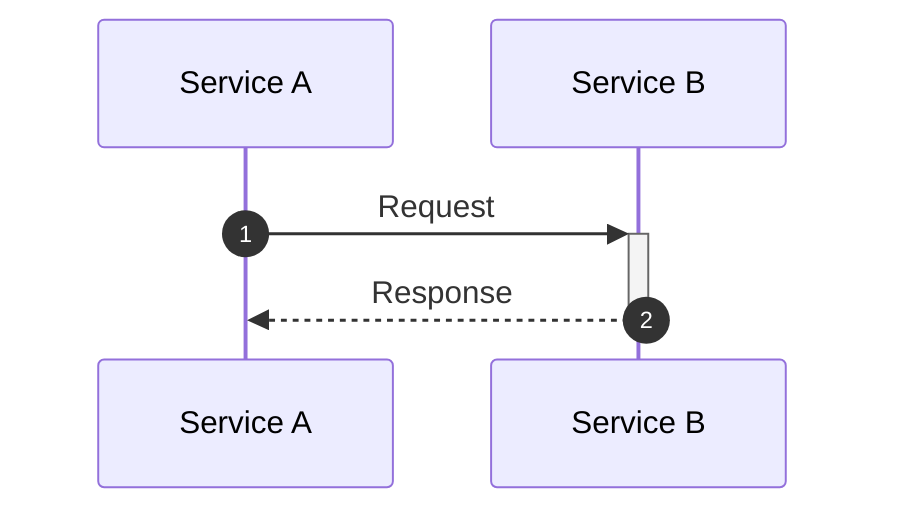

# Mermaid Sequence Diagrams

Generate, review, and fix Mermaid sequence diagrams that are syntactically correct, visually clear, and follow established best practices.

## Generating a New Diagram

1. Identify participants. List every system, service, or actor involved. Assign short IDs with descriptive aliases: `participant OMS as Order Management Service`.
2. Use `actor` for human users (renders stick figure), `participant` for services, `database` for data stores, `queue` for message brokers.
3. Determine the flow type:
   - Synchronous request/response → `->>` / `-->>` arrows.
   - Async fire-and-forget → `-)` / `--)` arrows.
   - Failed/rejected → `-x` / `--x` arrows.
   - Bidirectional (v11+) → `<<->>` / `<<-->>` arrows.
4. Declare all participants explicitly at the top to control left-to-right ordering. Place the initiator on the far left.
5. Write messages one per line. Keep message labels concise (e.g., `POST /orders`, `201 Created`). Move payload details to `Note` blocks.
6. Add `autonumber` when the diagram has 5+ messages.
7. Use `+`/`-` shorthand for activations on arrows (e.g., `->>+Server` to activate, `-->>-Client` to deactivate).
8. Model error paths with `alt`/`else`. Never produce a happy-path-only diagram — always include at least one failure branch.
9. Use control flow blocks as needed — read `references/02-control-flow-and-notes.md` for `alt`, `opt`, `loop`, `par`, `critical`, `break`, and `rect`.
10. Group related participants with `box` when there are 4+ participants across distinct layers.
11. Add `Note over` blocks sparingly for protocol details, SLA info, or phase labels.
12. Verify the output against the syntax rules below before presenting.
13. For styling, themes, or configuration directives, read `references/03-styling-and-best-practices.md`.
14. For real-world pattern inspiration (OAuth, webhooks, sagas, circuit breakers, retries), read `references/04-real-world-examples.md`.

## Reviewing / Fixing an Existing Diagram

1. Check for syntax errors using the table below. Fix any found.
2. Verify every `activate` has a matching `deactivate` (or use `+`/`-` shorthand consistently).
3. Verify every `alt`, `opt`, `loop`, `par`, `critical`, `break`, and `rect` block has a matching `end`.
4. Check for design anti-patterns — read `references/03-styling-and-best-practices.md` for the full list.
5. If the diagram exceeds 20 messages or 7 participants, recommend splitting into focused sub-diagrams.
6. Ensure arrow style usage is consistent (don't mix sync and async arrows without clear intent).
7. Confirm participants are declared explicitly with aliases if any name exceeds ~15 characters.

## Refactoring Large Diagrams

1. Identify logical phases (e.g., authentication, data processing, notification).
2. Split into one diagram per phase, with a brief prose description connecting them.
3. Keep shared participant declarations consistent across sub-diagrams.
4. Each sub-diagram should have ≤ 15-20 messages and ≤ 6-7 participants.

## Syntax Rules — Common Errors

| Mistake | Fix |
|---------|-----|
| Smart quotes `"` `"` | Use straight quotes `"` |
| Unicode arrows `→` `⇒` | Use ASCII arrows `->>` `-->` |
| Em/en dashes `—` `–` | Use plain hyphens `-` |
| The word `end` in labels | Wrap in quotes: `"end"`, brackets: `[end]`, or parens: `(end)` |
| Multiple statements on one line | One statement per line |
| Spaces in participant IDs | Use `CamelCase` or `snake_case` IDs with alias for display name |
| Semicolons in text | Escape as `#59;` |
| Unbalanced brackets | Ensure every `[` has `]`, every `(` has `)` |

## Output Template

Use this skeleton as the starting point for every diagram:

## References

- `references/01-syntax-fundamentals.md` — Participants, actors, specialized types, arrow reference, activation syntax.
- `references/02-control-flow-and-notes.md` — alt/opt/loop/par/critical/break/rect blocks, notes, sequence numbers, boxes, create/destroy.
- `references/03-styling-and-best-practices.md` — Themes, configuration, design principles, message labeling, anti-patterns, version compatibility.
- `references/04-real-world-examples.md` — JWT auth, OAuth 2.0, webhooks, saga pattern, event-driven microservices, retry backoff, circuit breaker.
- `references/05-cheat-sheet.md` — Arrow quick reference, control flow quick reference, participant types, escape sequences, CLI validation commands.
