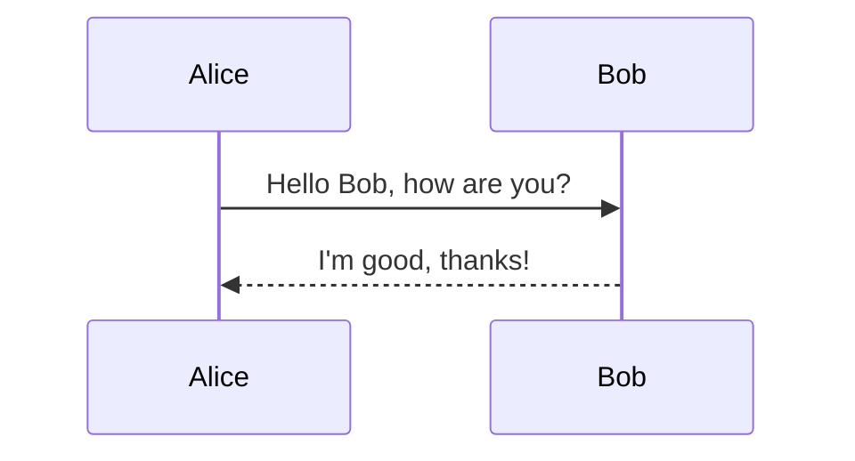
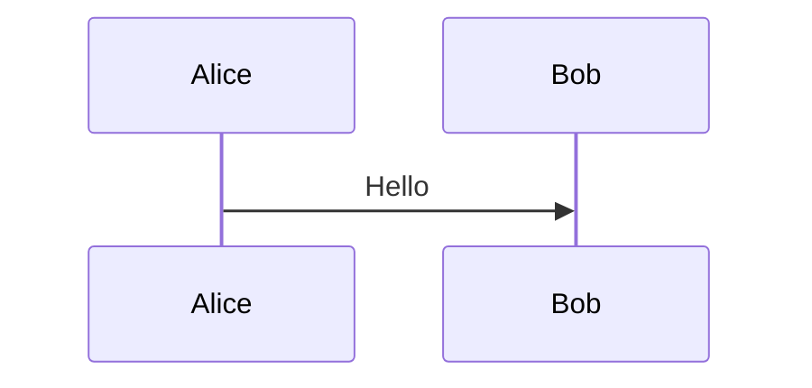
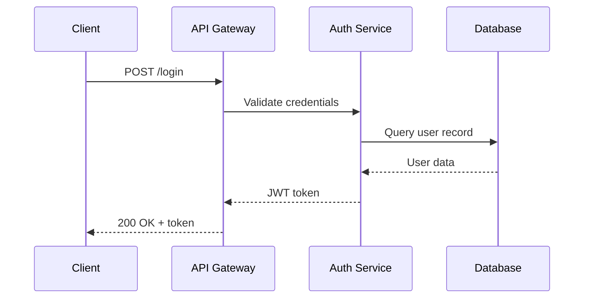
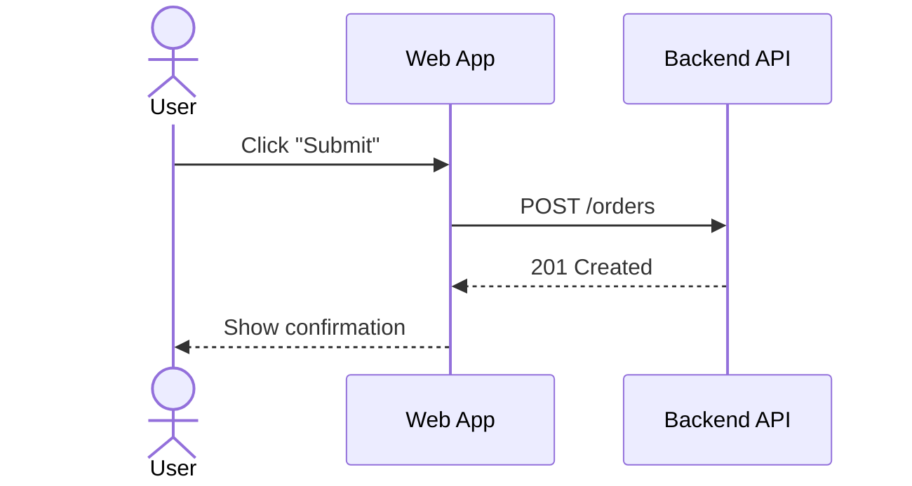
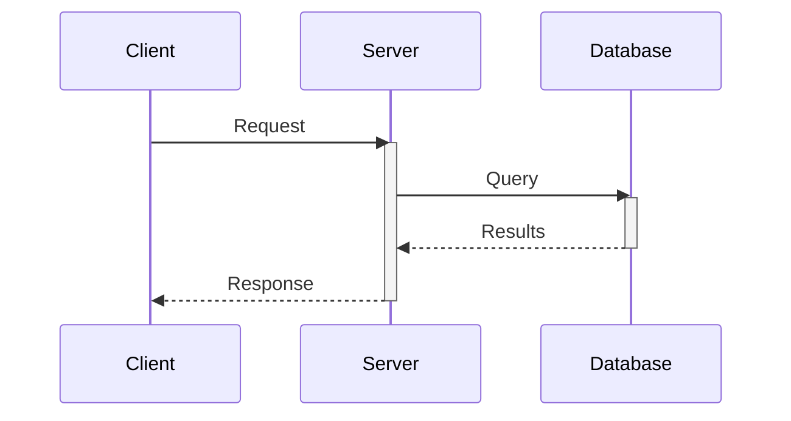
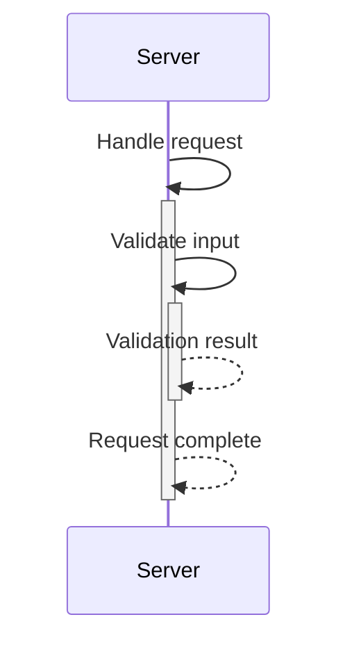

# Syntax Fundamentals

## Basic Structure

Every Mermaid sequence diagram starts with the `sequenceDiagram` keyword:

Key structural rules:

- **One statement per line.** Placing multiple statements on a single line causes parse errors.
- **Indentation is optional** but strongly recommended for readability.
- **Comments** use `%%` and must be on their own line.

## Participants and Actors

### Implicit Declaration

Participants render in the order they first appear in the diagram source. If you write `Alice->>Bob`, Alice appears on the left.

### Explicit Declaration with Aliases

Declare participants explicitly to control ordering and use short IDs with descriptive labels:

### Actor vs. Participant

Use `actor` for human users — this renders a stick figure instead of a rectangle:

### Specialized Participant Types

Mermaid supports shape-specific participants for architectural clarity:

| Keyword       | Shape         | Use For                     |
|---------------|---------------|-----------------------------|
| `participant` | Rectangle     | General-purpose components  |
| `actor`       | Stick figure  | Human users                 |
| `boundary`    | Boundary box  | System boundaries           |
| `control`     | Control circle| Controllers / orchestrators |
| `entity`      | Entity box    | Domain entities             |
| `database`    | Cylinder      | Databases and data stores   |
| `collections` | Stacked boxes | Collection endpoints        |
| `queue`       | Queue shape   | Message queues              |

### Naming Conventions

- Use **sentence case** or **PascalCase** for participant labels.
- Keep IDs alphanumeric with underscores: `[A-Za-z0-9_]+`. No spaces or hyphens in IDs.
- No trailing punctuation on IDs (`API` is valid; `API.` is not).
- Use aliases to keep message lines short: `participant OMS as Order Management Service`.

## Message Arrow Types

### Complete Arrow Reference

| Syntax     | Line Style | End          | Semantics                     |
|------------|-----------|--------------|-------------------------------|
| `->`       | Solid      | No arrow     | Informational flow            |
| `-->`      | Dotted     | No arrow     | Weak/indirect association     |
| `->>`      | Solid      | Arrowhead    | Synchronous request           |
| `-->>`     | Dotted     | Arrowhead    | Synchronous response/return   |
| `<<->>`    | Solid      | Bidirectional| Two-way sync (v11.0.0+)       |
| `<<-->>`   | Dotted     | Bidirectional| Two-way async (v11.0.0+)      |
| `-x`       | Solid      | Cross        | Failed delivery / destruction |
| `--x`      | Dotted     | Cross        | Failed async / timeout        |
| `-)`       | Solid      | Open arrow   | Fire-and-forget async send    |
| `--)`      | Dotted     | Open arrow   | Async response                |

### Choosing the Right Arrow

A practical convention used by many teams:

- **`->>` / `-->>` pair** for synchronous request/response (REST APIs, gRPC calls).
- **`-)` / `--)`** for async messaging (queue publish, webhook dispatch).
- **`-x`** to indicate a failed or rejected message.
- **`<<->>`** for bidirectional protocols (WebSocket handshake, mutual TLS).

Consistency matters more than any specific convention. Pick a style and document it for your team.

## Activation and Deactivation

Activations show when a participant is actively processing. They render as a narrow rectangle on the participant's lifeline.

### Explicit Syntax

### Shorthand Syntax (Preferred)

Append `+` to activate and `-` to deactivate directly on the arrow:

This is more concise and keeps the activation visually tied to the message that triggers it.

### Stacked Activations

A participant can have multiple overlapping activations (e.g., recursive calls or concurrent handlers):

