# Control Flow and Notes

## Table of Contents

- [Control Flow Blocks](#control-flow-blocks)
- [Notes](#notes)
- [Participant Grouping with box](#participant-grouping-with-box)
- [Advanced Lifecycle Features](#advanced-lifecycle-features)

## Control Flow Blocks

### Conditionals: alt / else

Model branching logic with `alt` and `else`:

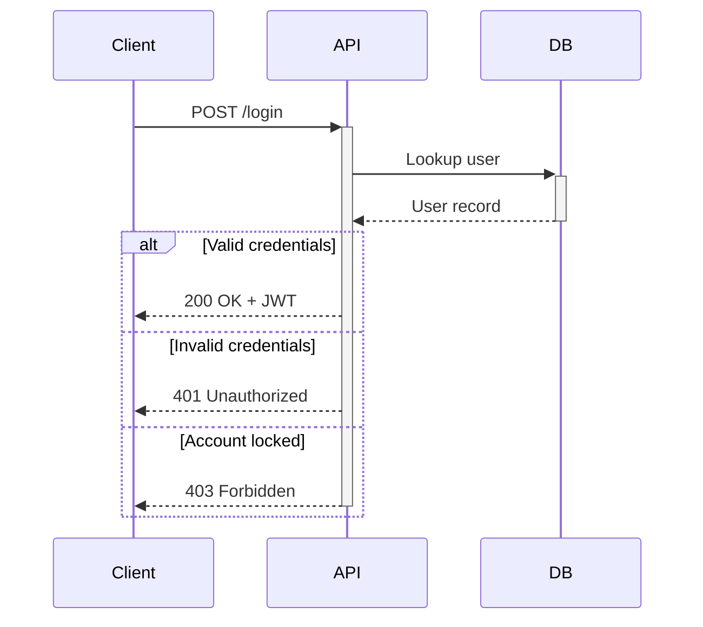

### Optional: opt

Use `opt` for paths that may or may not execute (if-without-else):

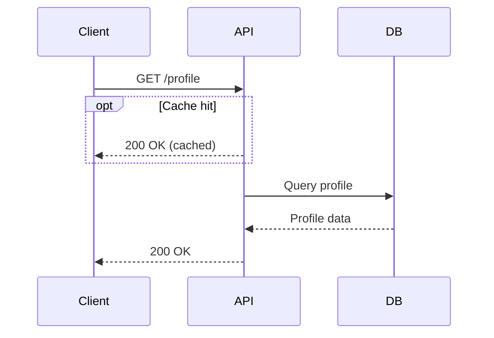

### Loops: loop

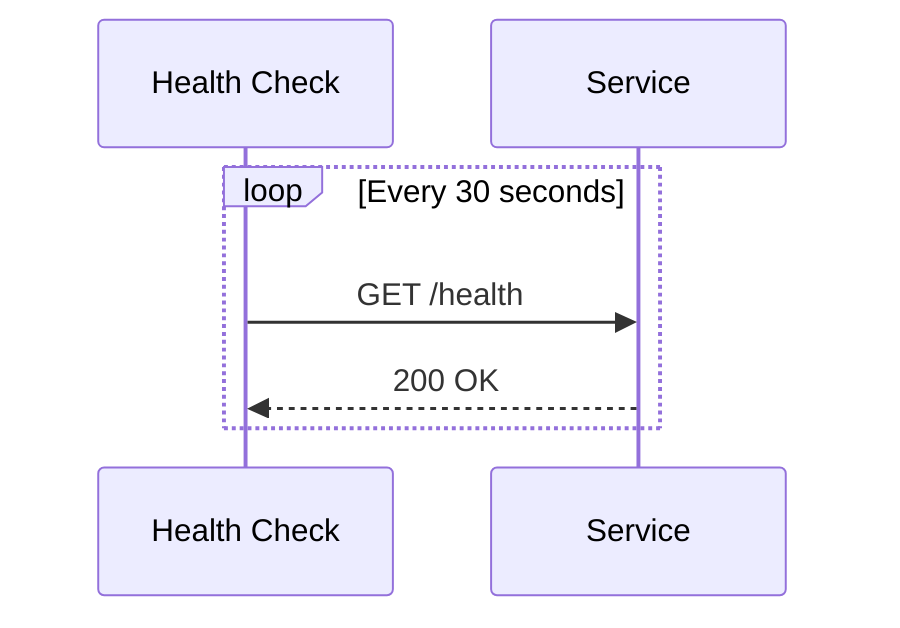

### Parallel Execution: par / and

Show concurrent actions:

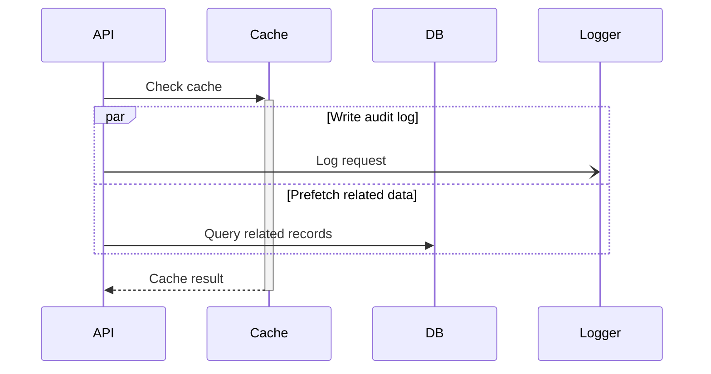

Parallel blocks can be nested for complex concurrency patterns.

### Critical Sections: critical / option

Model operations that must complete atomically, with fallback handling:

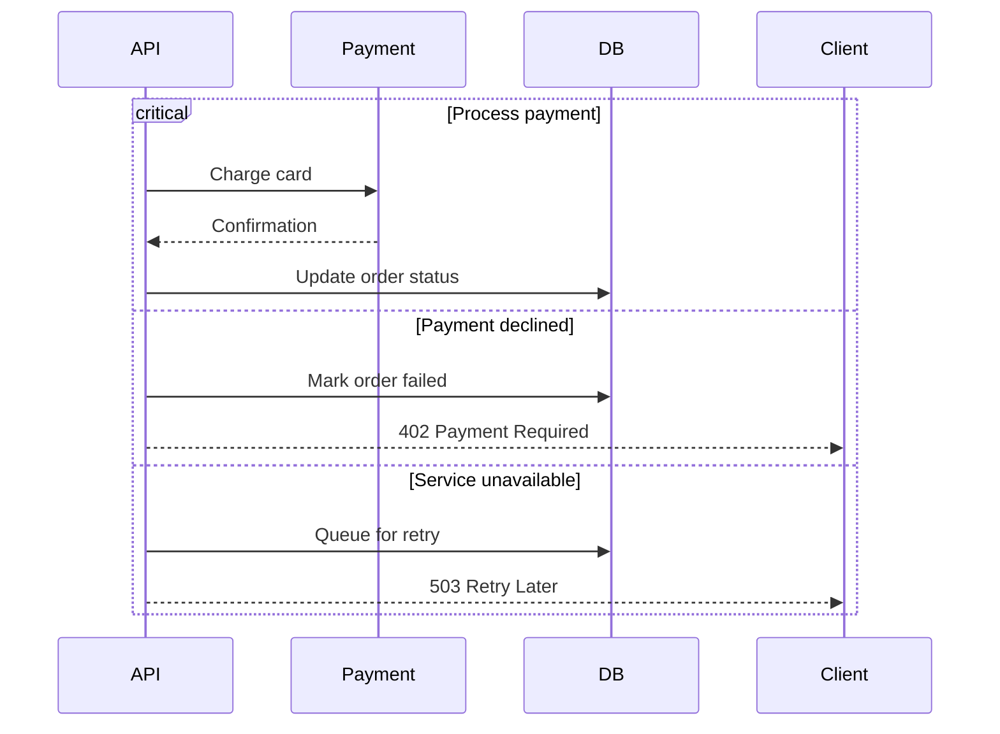

### Break

Exit early from a sequence:

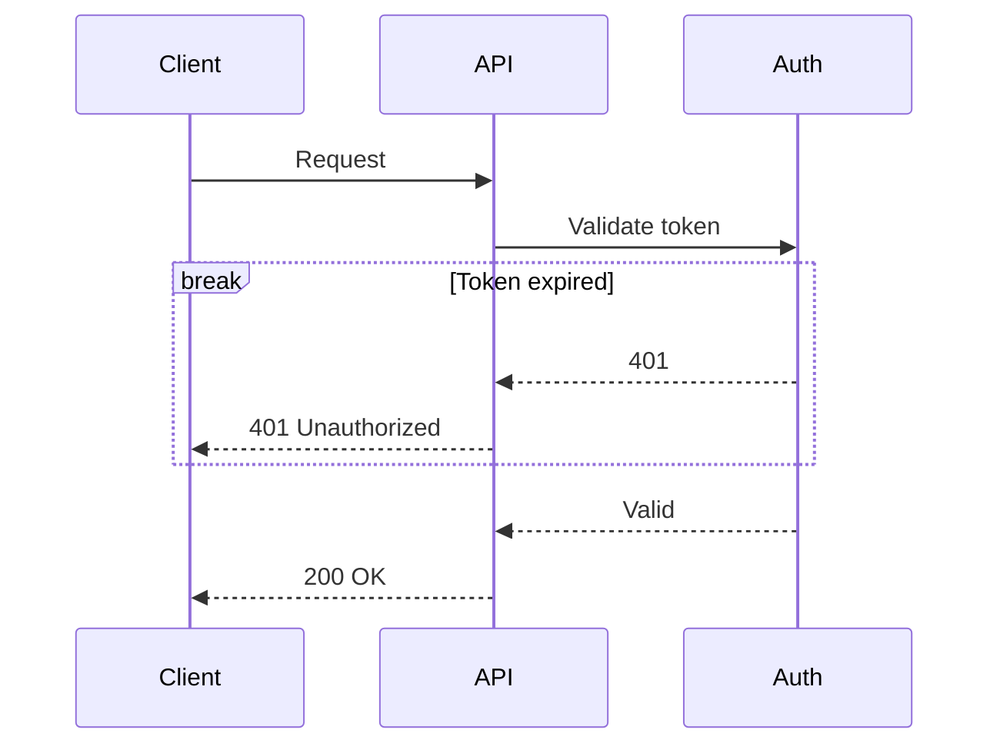

### Background Highlighting: rect

Use `rect` to visually group related messages without altering control flow:

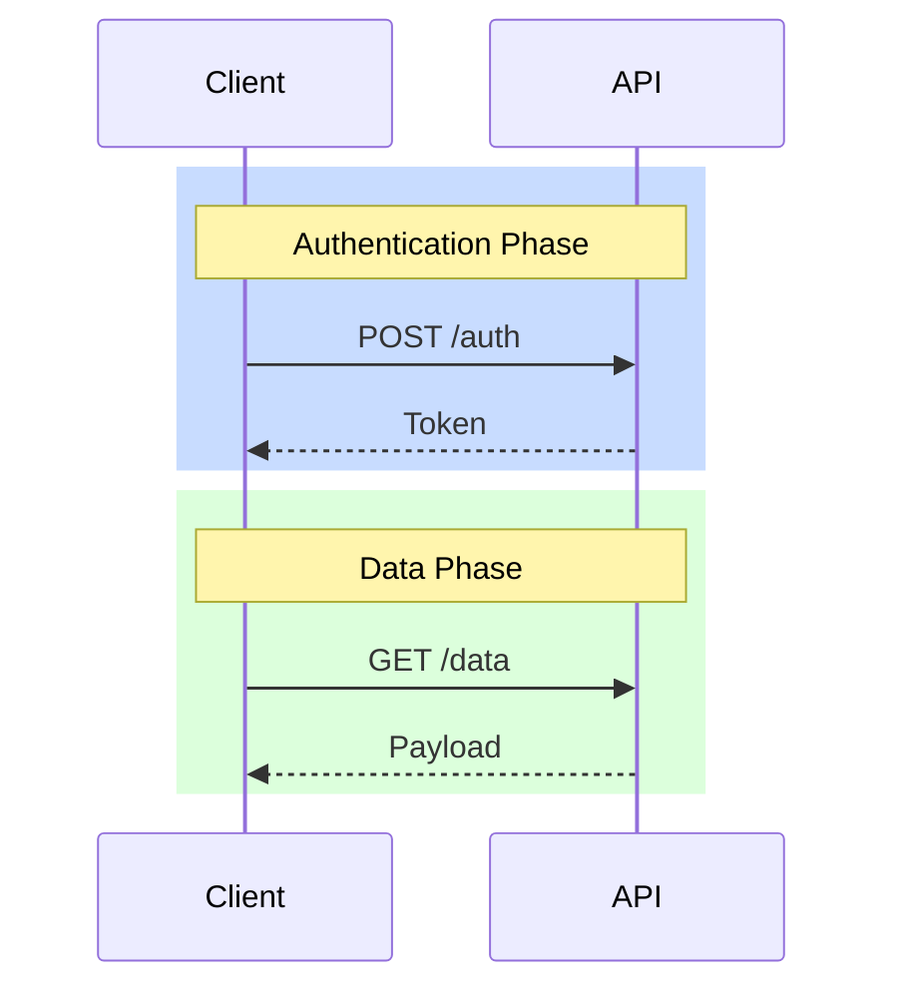

Supports `rgb()` and `rgba()` values.

## Notes

Notes provide context without adding message arrows.

### Positioning

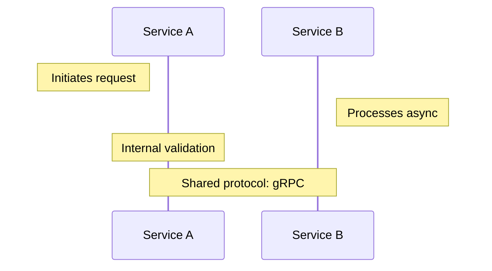

### Line Breaks in Notes

Use `<br/>` for multi-line notes:

```
Note over API: Validates JWT<br/>Checks permissions<br/>Rate-limits request
```

### When to Use Notes

- Explain **why** something happens, not just what.
- Annotate protocol details, SLA requirements, or assumptions.
- Section large diagrams into logical phases (combine with `rect`).

## Sequence Numbers

Enable automatic numbering to make diagrams easier to reference in discussions:

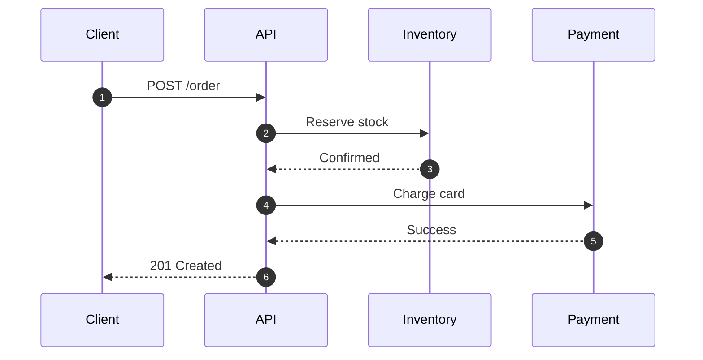

Use `autonumber` when a diagram has 5+ messages. It makes it easy to say "look at step 4" in code reviews or incident discussions.

## Grouping with Boxes

Group related participants into named, optionally colored boxes:

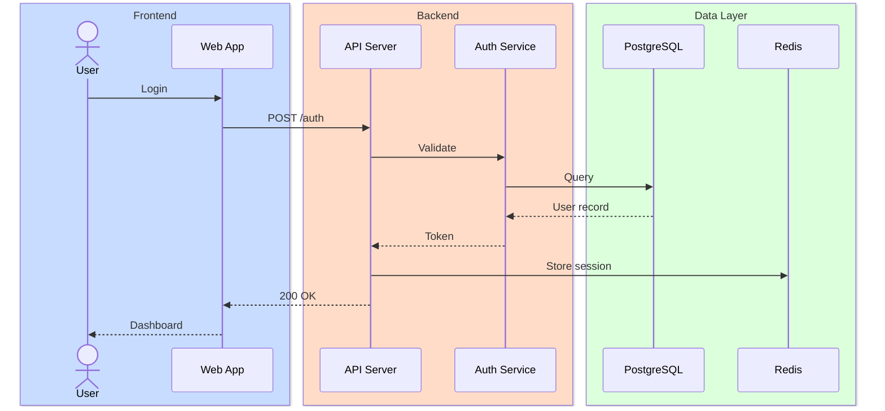

- Always provide a descriptive label for each box.
- Use colors sparingly and ensure legibility in both light and dark modes.
- Consider colorblind accessibility (avoid relying solely on red/green distinctions).

## Creating and Destroying Participants

Model participants that come into existence or are removed during a flow (v10.3.0+):

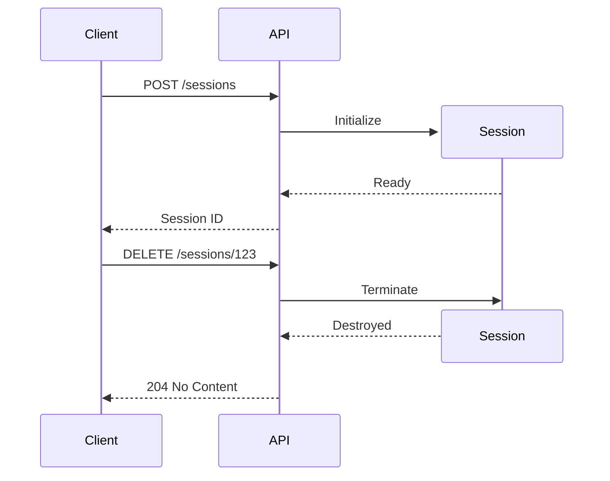

Rules:
- Only the **recipient** of a message can be created.
- Either sender or recipient can be destroyed.
