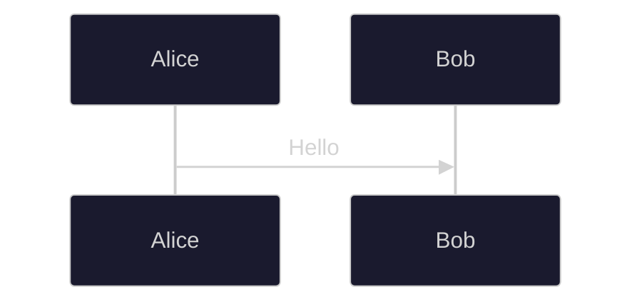
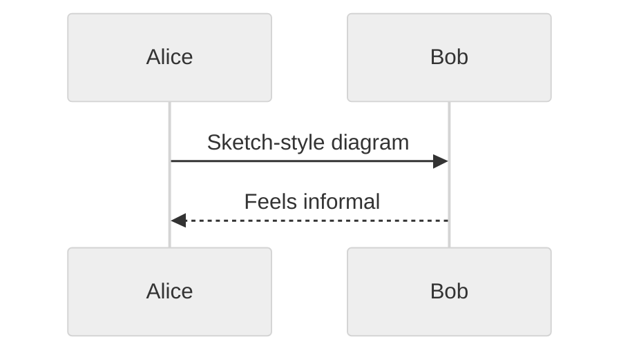

# Styling, Best Practices, and Anti-Patterns

## Styling and Configuration

### Inline Directives

Apply configuration directly in the diagram using `%%{ }%%`:



### Visual Looks (v11+)

Mermaid v11 introduced visual styles:



Available looks: `classic` (default), `handDrawn`, `neo`.

### Useful Configuration Parameters

| Parameter          | Purpose                              | Default                     |
|--------------------|--------------------------------------|-----------------------------|
| `mirrorActors`     | Repeat actors at bottom of diagram   | `false`                     |
| `showSequenceNumbers` | Enable autonumbering              | `false`                     |
| `actorFontSize`    | Font size for participant labels     | `14`                        |
| `messageFontSize`  | Font size for message text           | `16`                        |
| `noteFontSize`     | Font size for notes                  | `14`                        |
| `noteAlign`        | Note text alignment                  | `center`                    |
| `diagramMarginX`   | Horizontal margins                   | `50`                        |
| `diagramMarginY`   | Vertical margins                     | `10`                        |
| `messageMargin`    | Spacing between messages             | `35`                        |

## Best Practices

### Design Principles

1. **One concept per diagram.** If a diagram requires scrolling, split it. Aim for single-screen visibility in shared documentation (roughly 15-20 messages maximum).

2. **Declare participants explicitly.** This controls ordering and enables aliases. Place the initiator of the first message on the far left, with participants ordered following the primary flow direction.

3. **Use aliases aggressively.** Short IDs keep message lines readable. `participant OMS as Order Management Service` lets you write `C->>OMS: Create order` instead of a sprawling line.

4. **Show both happy and sad paths.** Use `alt`/`else` to model error branches. Omitting failure paths makes diagrams misleading — real systems fail.

5. **Use activations to show processing duration.** The `+`/`-` shorthand keeps the source compact while making it immediately clear which participants are active.

6. **Move details to notes.** Message labels should be concise (e.g., `POST /orders`). Put payload details, SLA constraints, or protocol specifics in `Note` blocks.

7. **Add `autonumber` for complex diagrams.** Sequence numbers make diagrams referenceable in reviews and incident reports.

### Message Labeling Conventions

For REST APIs:

```
Client->>API: POST /orders
API-->>Client: 201 Created
```

- HTTP method in UPPERCASE at the start.
- Include response codes with descriptions.

For async messaging:

```
API-)Queue: OrderCreated event
Worker--)API: Acknowledgment
```

For GraphQL:

```
Client->>API: mutation createOrder
API-->>Client: { order { id } }
```

### Version Control

- Store Mermaid source in `.mmd` files alongside the code they document.
- Diagrams in Markdown files render natively on GitHub, GitLab, and most documentation platforms.
- Treat diagrams as code: review them in PRs, keep them up to date when behavior changes.

## Anti-Patterns and Common Mistakes

### Syntax Errors

| Mistake | Problem | Fix |
|---------|---------|-----|
| Smart quotes `\u201c` `\u201d` | Parse failure | Use straight quotes `"` |
| Unicode arrows `\u2192` `\u21d2` | Not recognized | Use ASCII arrows `->>` `-->` |
| Em/en dashes `\u2014` `\u2013` | Parse failure | Use plain hyphens `-` |
| Unbalanced brackets | Render failure | Ensure every `[` has `]`, every `(` has `)` |
| The word `end` in labels | Prematurely closes a block | Wrap in quotes: `"end"`, brackets: `[end]`, or parens: `(end)` |
| Multiple statements on one line | Parse failure | One statement per line |
| Spaces in participant IDs | Parse failure | Use `CamelCase` or `snake_case` IDs |
| Semicolons in text | Treated as line break | Escape as `#59;` |

### Design Anti-Patterns

1. **Omitting failure paths.** A diagram showing only the happy path is incomplete and misleading. Always model at least the primary error scenario.

2. **Too many arrow styles in one diagram.** Mixing solid, dotted, cross, and async arrows without a clear convention confuses readers. Establish and document a convention.

3. **Repeating long names instead of using aliases.** If you write `Order Management Service` in every message, the diagram becomes unreadable.

4. **Embedding implementation details in messages.** Message labels should describe *what*, not *how*. Avoid `Parse JSON body, validate schema, check auth header` as a single message label.

5. **Massive monolithic diagrams.** If your diagram has 30+ messages or 8+ participants, break it into focused sub-diagrams (e.g., one for auth, one for order processing).

6. **Ignoring platform rendering differences.** GitHub, GitLab, VS Code, and Obsidian each support slightly different Mermaid feature sets. Test in your actual rendering target.

7. **Not testing in dark mode.** Custom colors that look great on a white background may be illegible in dark mode. Always verify.

## Version Compatibility

As of early 2026, Mermaid is at v11.12.x. Key version milestones:

| Version | Key Sequence Diagram Feature |
|---------|------------------------------|
| v10.3.0 | `create` / `destroy` participant directives |
| v10.7.0 | Bug fixes for create/destroy edge cases |
| v11.0.0 | Bidirectional arrows (`<<->>`, `<<-->>`) |
| v11.x   | Hand-drawn look, Neo theme, ELK layout engine |

Always check that your rendering platform supports the Mermaid version required by the features you use. GitHub, in particular, may lag behind the latest release.
