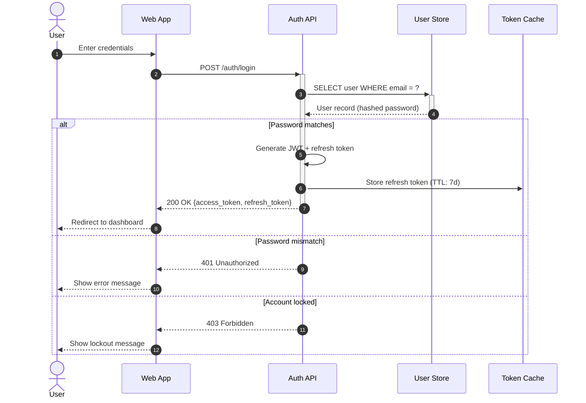
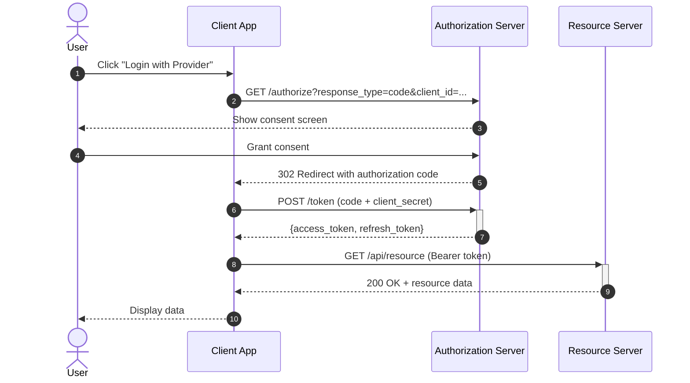
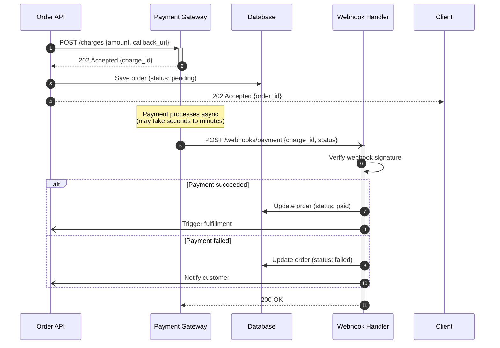
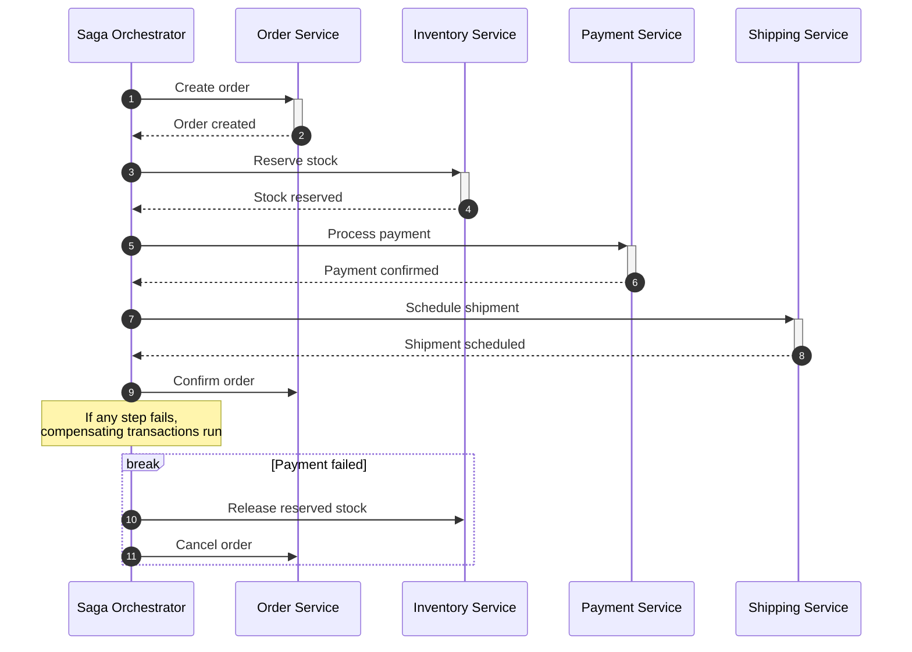
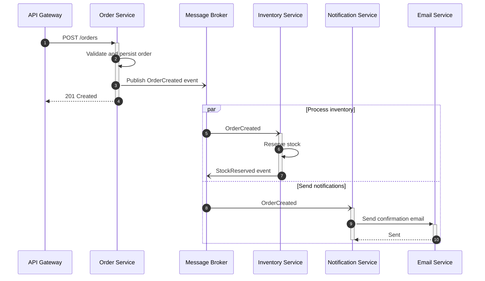
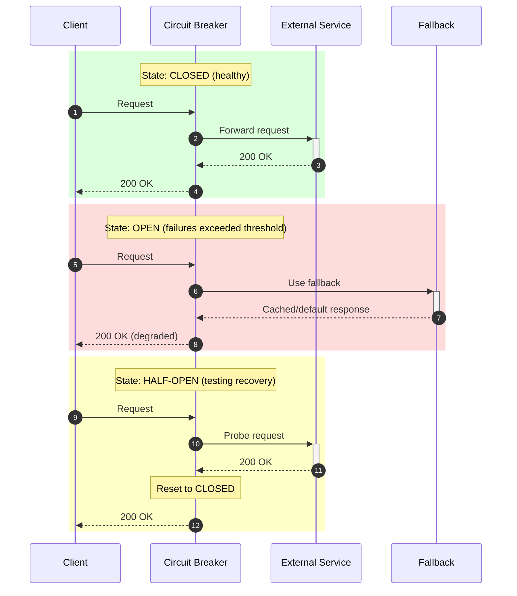

# Real-World Examples

## REST API: Authentication with JWT



## OAuth 2.0 Authorization Code Flow



## Webhook Callback Pattern



## Saga Pattern: Distributed Transaction



## Event-Driven Microservices with Message Queue



## Retry with Exponential Backoff

```mermaid
sequenceDiagram
    autonumber
    participant C as Client
    participant API as Unreliable API

    C->>+API: Request
    API--x-C: 503 Service Unavailable
    deactivate API

    Note over C: Wait 1s (attempt 1/3)

    C->>+API: Request (retry)
    API--x-C: 503 Service Unavailable
    deactivate API

    Note over C: Wait 2s (attempt 2/3)

    C->>+API: Request (retry)
    API-->>-C: 200 OK

    Note over C, API: Exponential backoff: 1s, 2s, 4s...
```

## Circuit Breaker Pattern


