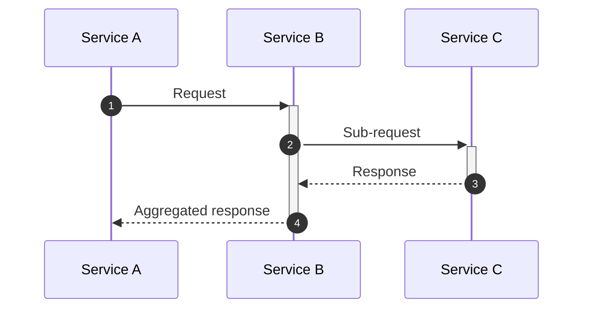

# Quick Reference Cheat Sheet

## Minimal Template



## Arrow Quick Reference

```
->>    Sync request (solid, arrowhead)
-->>   Sync response (dotted, arrowhead)
-)     Async send (solid, open arrow)
--)    Async response (dotted, open arrow)
-x     Failed/rejected (solid, cross)
--x    Failed async (dotted, cross)
<<->>  Bidirectional sync (v11+)
<<-->> Bidirectional async (v11+)
```

## Control Flow Quick Reference

```
alt / else / end       Conditional branches
opt / end              Optional block (if without else)
loop / end             Repeated execution
par / and / end        Parallel execution
critical / option / end  Atomic operation with fallbacks
break / end            Early exit
rect rgb() / end       Background highlighting
```

## Participant Types

```
participant X as Label   Rectangle (general component)
actor X as Label         Stick figure (human user)
boundary X as Label      Boundary box (system boundary)
control X as Label       Control circle (orchestrator)
entity X as Label        Entity box (domain entity)
database X as Label      Cylinder (database)
collections X as Label   Stacked boxes (collection endpoint)
queue X as Label         Queue shape (message queue)
```

## Escape Sequences

```
#35;   →  #
#59;   →  ;
<br/>  →  Line break in labels/notes
"end"  →  Literal word "end" in labels
```

## Validation

```bash
# Render and validate a .mmd file
npx -p @mermaid-js/mermaid-cli mmdc -i diagram.mmd -o diagram.png

# High-resolution output
npx -p @mermaid-js/mermaid-cli mmdc -s 3 -i diagram.mmd -o diagram.png

# Render with dark theme
npx -p @mermaid-js/mermaid-cli mmdc -i diagram.mmd -o diagram.png -t dark
```
