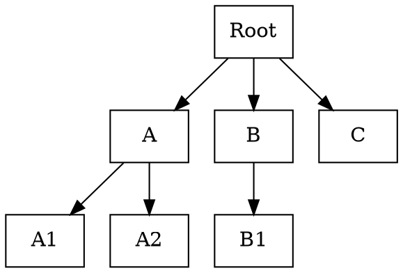
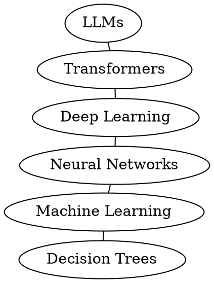

# Best Practices by Diagram Type

## Table of Contents

- [Flowcharts](#flowcharts)
- [Sequence Diagrams](#sequence-diagrams)
- [Architecture / System Diagrams](#architecture--system-diagrams)
- [Entity-Relationship Diagrams](#entity-relationship-diagrams)
- [State Machine Diagrams](#state-machine-diagrams)
- [Mindmaps and Tree Diagrams](#mindmaps-and-tree-diagrams)
- [Knowledge Graphs / Network Diagrams](#knowledge-graphs--network-diagrams)

---

## Flowcharts

**Tool:** Mermaid (GitHub embedding) or D2 (everything else).

**Rules:**
- Pick one direction and stick with it: `TB` or `LR`.
- Use decision nodes (diamonds) sparingly — each one adds edges.
- Group related steps into subgraphs/containers.
- Avoid bidirectional arrows.
- Limit to one merge point (diamond → multiple paths → merge) per 5 nodes — decompose otherwise.

**Mermaid example (with ELK):**

```
---
config:
  layout: elk
---
flowchart TB
    A[Start] --> B{Decision}
    B -->|Yes| C[Action 1]
    B -->|No| D[Action 2]
    C --> E[End]
    D --> E
```

**D2 example:**

```d2
direction: down
A -> B -> C
B -> D
C -> E
D -> E
```

---

## Sequence Diagrams

**Tool:** Mermaid (simplicity) or PlantUML (advanced features like grouping, alternatives, loops).

Layout is handled automatically by purpose-built rendering — arrow mess is rare.

**Rules:**
- Name participants explicitly rather than relying on inference from messages.
- Keep participants to 3–5.
- Use `activate`/`deactivate` to show lifeline scope.
- Avoid self-calls (a participant calling itself) — they clutter the diagram.
- Do not mix synchronous and asynchronous arrows without clear labeling.

**Mermaid example:**

```
sequenceDiagram
    participant C as Client
    participant S as Server
    participant D as Database
    C->>S: POST /users
    activate S
    S->>D: INSERT INTO users
    activate D
    D-->>S: OK
    deactivate D
    S-->>C: 201 Created
    deactivate S
```

---

## Architecture / System Diagrams

**Tool:** D2 (best container support), Structurizr DSL (for C4 model), or PlantUML (component/deployment diagrams).

Containers (grouping boxes) give the layout engine structural hints and make the diagram scannable.

**Rules:**
- Use explicit layer groupings: Frontend, Backend, Data.
- Draw connections crossing layer boundaries, not within them.
- Add icons/shapes for different component types where supported.

**D2 example:**

```d2
direction: down

frontend: Frontend {
  web: Web App
  mobile: Mobile App
}

backend: Backend {
  api: API Gateway
  auth: Auth Service
}

frontend.web -> backend.api: REST
frontend.mobile -> backend.api: REST
backend.api -> backend.auth: Verify token
```

**Structurizr DSL example** (rendered via Kroki):

```
workspace {
    model {
        user = person "User"
        system = softwareSystem "System" {
            webapp = container "Web App"
            api = container "API"
            db = container "Database"
        }
        user -> webapp "Uses"
        webapp -> api "Calls"
        api -> db "Reads/writes"
    }
    views {
        container system {
            include *
            autolayout lr
        }
    }
}
```

---

## Entity-Relationship Diagrams

**Tool:** Mermaid `erDiagram` (simple) or D2 with `sql_table` shapes (richer output).

**Rules:**
- Specify cardinality notation explicitly (one-to-many, many-to-many).
- Keep entity count ≤5 — split larger models into subject-area sub-diagrams.

**Mermaid example:**

```
erDiagram
    USER ||--o{ ORDER : places
    ORDER ||--|{ LINE_ITEM : contains
    PRODUCT ||--o{ LINE_ITEM : "appears in"
```

---

## State Machine Diagrams

**Tool:** Mermaid `stateDiagram-v2` or PlantUML state syntax.

**Rules:**
- Always include start (`[*]`) and end states.
- Label every transition — unlabeled arrows are ambiguous.
- Keep states to 3–5; decompose complex machines into nested state diagrams.

**Mermaid example:**

```
stateDiagram-v2
    [*] --> Idle
    Idle --> Processing: submit
    Processing --> Success: ok
    Processing --> Error: fail
    Error --> Idle: retry
    Success --> [*]
```

**Layout note:** Mermaid's state diagram layout can be erratic with Dagre. ELK significantly improves results. PlantUML's state renderer often produces cleaner output as an alternative.

---

## Mindmaps and Tree Diagrams

**Tool:** Mermaid `mindmap` (quick) or Graphviz `dot` (precise tree layout).

**Mermaid example:**

```
mindmap
  root((Project))
    Planning
      Requirements
      Timeline
    Execution
      Development
      Testing
    Delivery
      Deployment
      Monitoring
```

**Graphviz example (tree):**



---

## Knowledge Graphs / Network Diagrams

**Tool:** Graphviz with `neato` or `fdp` (force-directed layout).

The one case where force-directed layout is correct — no inherent direction, and the goal is revealing clusters and proximity.

**Rules:**
- Use `graph` (undirected) not `digraph` (directed).
- Set `overlap=false` to prevent node collisions.

**Graphviz example:**


