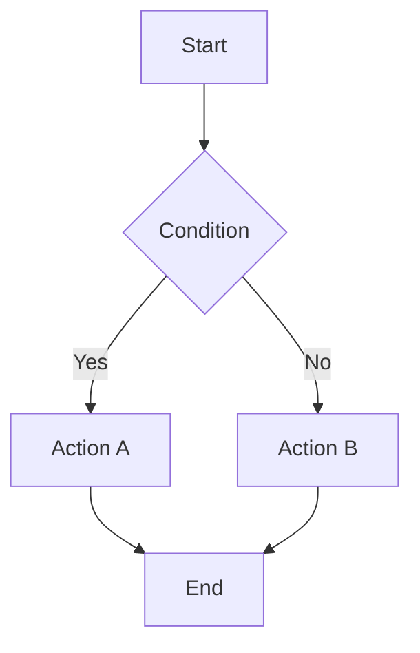
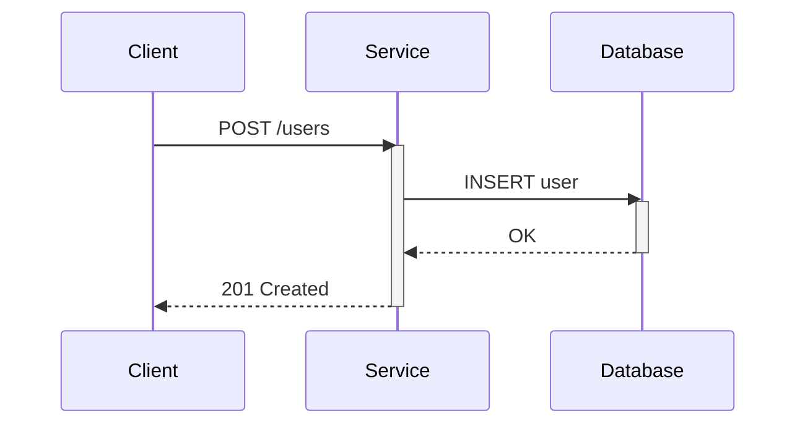
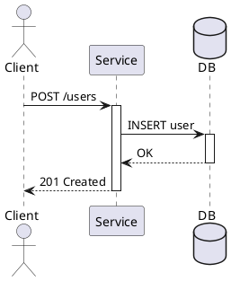
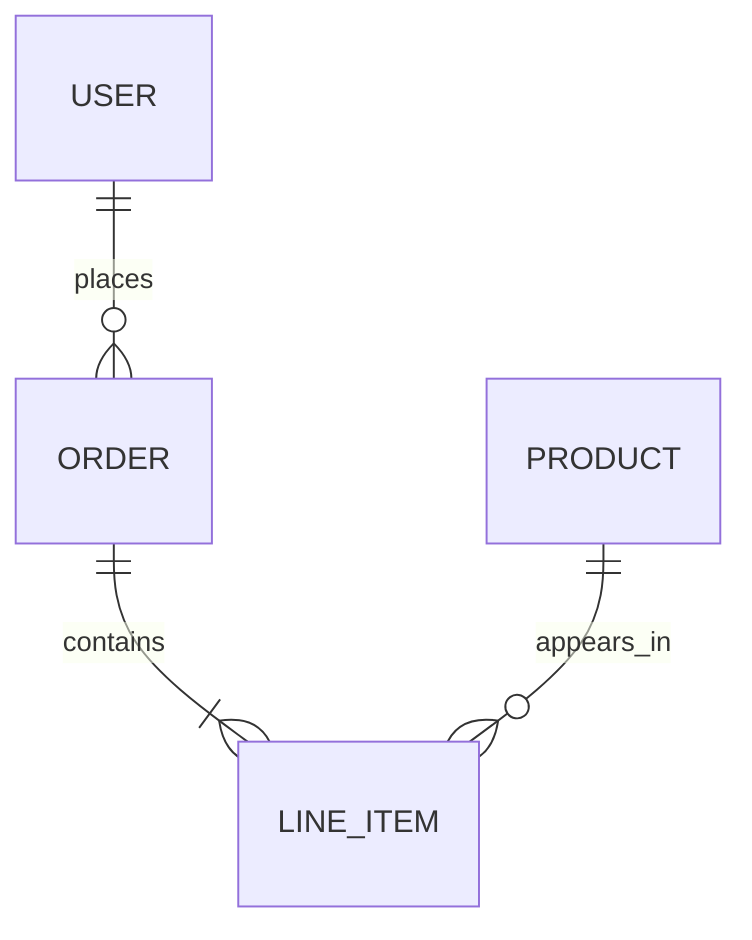
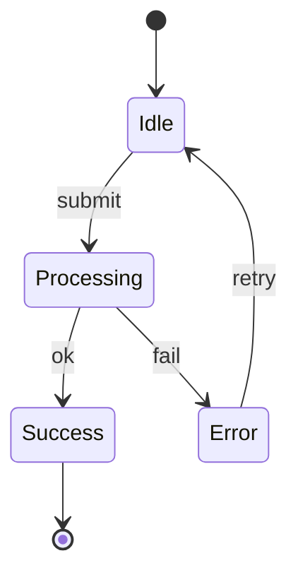
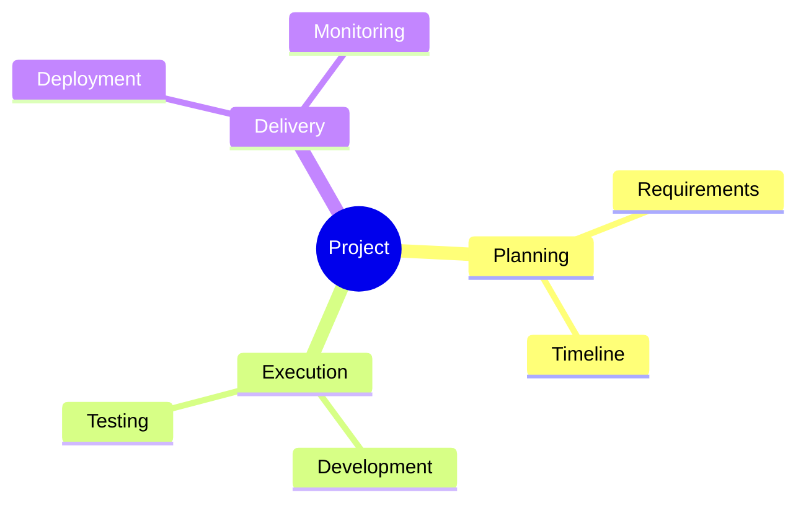
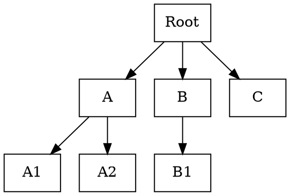
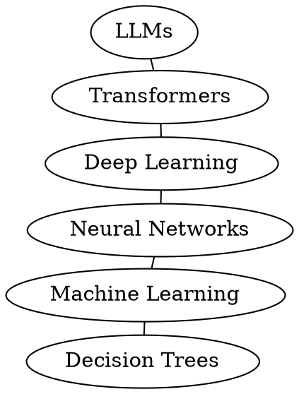

# Diagram Patterns by Type

## Table of Contents

- [Flowcharts](#flowcharts)
- [Sequence Diagrams](#sequence-diagrams)
- [Architecture/System Diagrams](#architecturesystem-diagrams)
- [Entity-Relationship Diagrams (ERD)](#entity-relationship-diagrams-erd)
- [State Machine Diagrams](#state-machine-diagrams)
- [Mindmaps and Tree Diagrams](#mindmaps-and-tree-diagrams)
- [Knowledge Graphs / Network Diagrams](#knowledge-graphs--network-diagrams)
- [Cross-Type Readability Rules](#cross-type-readability-rules)

---

## Flowcharts

**Default tool**
- Mermaid for GitHub-native output
- D2 for rendered artifacts

**Generation rules**
1. Set one dominant direction (`TB`/`LR`, or `direction: down`).
2. Keep node budget small (3-5 by default).
3. Use decision nodes only when an actual branch exists.
4. Merge branches intentionally; avoid gratuitous reconvergence.

**Mermaid pattern**



**D2 pattern**

```d2
direction: down
A: Start
B: Condition?
C: Action A
D: Action B
E: End
A -> B
B -> C: Yes
B -> D: No
C -> E
D -> E
```

**Avoid**
- Bidirectional arrows in process flows
- Multiple crossing branches in a single small chart
- Node labels with parser-breaking punctuation unless quoted

---

## Sequence Diagrams

**Default tool**
- Mermaid for simple sequence diagrams
- PlantUML for advanced sequence semantics

**Generation rules**
1. Explicitly declare participants.
2. Keep participants to ~3-5 unless user requests more.
3. Use activation blocks to show processing scope.
4. Label key messages with API/event names.

**Mermaid pattern**



**PlantUML pattern**



**Avoid**
- Unexplained arrow-style mixing (sync vs async)
- Excessive self-calls
- Too many participants in one timeline

---

## Architecture/System Diagrams

**Default tool**
- D2

**Generation rules**
1. Group nodes by layer/domain (frontend, backend, data, external).
2. Show cross-layer communication explicitly.
3. Keep labels functional (component purpose + protocol if needed).
4. Prefer layered direction (`down` or `right`).

**D2 pattern**

```d2
direction: down

frontend: Frontend {
  web: Web App
  mobile: Mobile App
}

backend: Backend {
  api: API Gateway
  auth: Auth Service
}

data: Data {
  db: Primary DB
}

frontend.web -> backend.api: HTTPS
frontend.mobile -> backend.api: HTTPS
backend.api -> backend.auth: token verify
backend.auth -> data.db: read/write
```

**Avoid**
- Flat ungrouped architecture blobs
- Every node connected to every other node
- Mixed abstraction levels in one diagram

---

## Entity-Relationship Diagrams (ERD)

**Default tool**
- Mermaid `erDiagram` for simple cases
- D2 with table-style nodes for custom styling/pipelines

**Generation rules**
1. Model entities first, relationships second.
2. Encode cardinality explicitly.
3. Split by bounded context if >5 entities.

**Mermaid pattern**



**Avoid**
- Missing cardinalities
- Relationship verbs that do not describe domain meaning
- Giant all-domain ERDs in one panel

---

## State Machine Diagrams

**Default tool**
- Mermaid `stateDiagram-v2` (simple)
- PlantUML (complex)

**Generation rules**
1. Include explicit start/end nodes.
2. Label transitions with trigger names.
3. Keep state set compact; nest or split if complex.

**Mermaid pattern**



**Avoid**
- Unlabeled transitions
- Hidden terminal states
- Transition lines that imply impossible loops

---

## Mindmaps and Tree Diagrams

**Default tool**
- Mermaid `mindmap` for quick docs
- Graphviz `dot` for precise trees

**Mermaid pattern**



**Graphviz tree pattern**



---

## Knowledge Graphs / Network Diagrams

**Default tool**
- Graphviz `neato`/`fdp` (force-directed)

**Generation rules**
1. Use undirected `graph` with `--` edges unless direction is meaningful.
2. Enable anti-overlap options.
3. Prioritize cluster readability over strict flow.

**Graphviz pattern**



---

## Cross-Type Readability Rules

Apply these rules to every diagram type:

1. Keep one primary message per diagram.
2. Keep node count small unless user explicitly requests broad coverage.
3. Prefer short labels; move detail to surrounding text.
4. Enforce a dominant reading direction where applicable.
5. Split complex diagrams into focused sub-diagrams.
6. Validate rendering before presenting output.
7. If output is ambiguous, ask one clarifying question before expansion.
