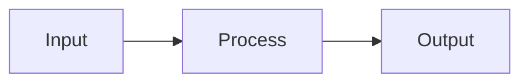

# Generation, Validation, and Operations

## Table of Contents

- [Prompting Patterns for LLM Diagram Generation](#prompting-patterns-for-llm-diagram-generation)
- [Validation Loop (Generate -> Validate -> Fix)](#validation-loop-generate---validate---fix)
- [Syntax Pitfalls by Tool](#syntax-pitfalls-by-tool)
- [Rendering Pipelines](#rendering-pipelines)
  - [Direct CLI Rendering](#direct-cli-rendering)
  - [Kroki Unified API](#kroki-unified-api)
  - [GitHub-Native Mermaid](#github-native-mermaid)
  - [Mermaid with ELK](#mermaid-with-elk)
  - [CI/CD Rendering](#cicd-rendering)
- [Tool Selection Decision Tree](#tool-selection-decision-tree)
- [Common Pitfalls and Corrective Actions](#common-pitfalls-and-corrective-actions)
- [Further Reading](#further-reading)

---

## Prompting Patterns for LLM Diagram Generation

Use explicit constraints to prevent over-generation.

**Recommended prompt frame**

```text
Generate a <tool> <diagram type>.
Constraints:
- Keep to 3-5 nodes unless required otherwise
- Use <TB/LR/down/right> direction
- Label all edges
- Avoid parser-breaking characters in labels
- Return only diagram code
```

**Prompting rules**

1. Specify the diagram DSL explicitly.
2. Specify the diagram type explicitly.
3. Specify node budget explicitly.
4. Specify direction explicitly.
5. Specify label constraints explicitly.

Avoid vague asks like "make a diagram of this".

---

## Validation Loop (Generate -> Validate -> Fix)

Run this loop every time:

1. Generate diagram source.
2. Render with CLI/API.
3. If render fails, capture stderr.
4. Ask for a corrected version using the exact error text.
5. Repeat until render succeeds.

This loop usually converges in 1-2 iterations for small diagrams.

**Example repair prompt**

```text
The diagram failed to render.
Renderer error:
<stderr>

Fix the diagram source and return only corrected code.
```

**Optional semantic pass (vision-capable model)**

1. Render PNG.
2. Ask model to inspect readability and semantic correctness.
3. Regenerate if relationships are wrong or cluttered.

Use this only when semantic fidelity is critical.

---

## Syntax Pitfalls by Tool

### Mermaid

Common failures:
- Unquoted labels with punctuation (`:`, `(`, `)`, `[`, `]`)
- Missing `end` for `subgraph`
- Inconsistent link syntax in the same diagram

Mitigations:
- Quote labels with special characters.
- Keep subgraph blocks minimal.
- Use one link style per diagram intent.

### D2

Common failures:
- Reserved words used as IDs
- Mermaid-style arrows (`-->`) instead of D2 (`->`)
- Incorrect container nesting

Mitigations:
- Use simple alphanumeric IDs.
- Normalize to `->`.
- Keep container nesting shallow and explicit.

### Graphviz DOT

Common failures:
- Mixing `graph` with directed arrows (`->`)
- Unquoted multi-word labels
- Missing braces or malformed attribute blocks

Mitigations:
- Use `graph` + `--` for undirected, `digraph` + `->` for directed.
- Quote multi-word labels.
- Keep attributes simple and local.

### PlantUML

Common failures:
- Missing `@startuml` / `@enduml`
- Mixing syntax from different UML diagram families
- Arrow token misuse

Mitigations:
- Always include delimiters.
- Generate one UML diagram family per block.
- Keep arrow conventions consistent within that block.

---

## Rendering Pipelines

### Direct CLI Rendering

Use local tools when available.

```bash
# Mermaid
mmdc -i input.mmd -o output.svg

# D2
d2 input.d2 output.svg

# Graphviz
dot -Tsvg input.dot -o output.svg

# PlantUML
java -jar plantuml.jar -tsvg input.puml
```

Capture stderr and non-zero exit codes as validation failures.

### Kroki Unified API

Use Kroki when you need one endpoint for multiple DSLs.

```bash
curl -X POST https://kroki.io/mermaid/svg \
  -H "Content-Type: text/plain" \
  -d 'flowchart TB
  A --> B --> C' \
  -o diagram.svg
```

Use self-hosted Kroki for private diagrams or compliance needs.

### GitHub-Native Mermaid

Use Mermaid code fences when native rendering in Markdown is required.

````markdown

````

Tradeoff:
- Easiest integration
- Limited control versus rendered SVG artifacts

### Mermaid with ELK

Use ELK layout when environment supports it and layout quality matters.

```yaml
---
config:
  layout: elk
---
```

Note platform differences:
- Local ELK rendering may differ from GitHub's default Mermaid layout.
- If consistency is required, publish rendered SVGs.

### CI/CD Rendering

Render diagrams in CI to prevent broken docs.

```yaml
- name: Render diagrams
  run: |
    for f in docs/diagrams/*.d2; do
      d2 "$f" "${f%.d2}.svg"
    done
```

Fail pipeline when rendering fails.

---

## Tool Selection Decision Tree

Use this routing in order:

1. Must render natively in GitHub Markdown?
   - Yes -> Mermaid
   - No -> continue

2. Is this UML-first sequence notation?
   - Yes -> PlantUML
   - No -> continue

3. Is this a directed dependency or hierarchy-heavy graph needing precise rank/crossing control?
   - Yes -> Graphviz `dot`
   - No -> continue

4. Is this a general (non-C4) architecture/flow/state/ER output with controlled rendering pipeline?
   - Yes -> D2

5. Is this non-directional concept/network clustering?
   - Yes -> Graphviz `neato` or `fdp`

When uncertain, choose D2 for rendered artifacts and Mermaid for GitHub-native docs.

---

## Common Pitfalls and Corrective Actions

1. **Over-elaborated diagrams**
   - Symptom: 10+ nodes for a simple explanation.
   - Action: enforce 3-5 node budget and split scenarios.

2. **Unclear flow direction**
   - Symptom: reader cannot infer start-to-end.
   - Action: set direction in prompt and source (`TB`, `direction: down`, `rankdir=TB`).

3. **Wrong diagram type**
   - Symptom: temporal interaction drawn as flowchart.
   - Action: remap to sequence diagram.

4. **Parser failures from labels**
   - Symptom: render errors on punctuation.
   - Action: quote labels or simplify text.

5. **Position micromanagement prompts**
   - Symptom: requests like "put DB exactly lower-right".
   - Action: rewrite as structural constraints (layer, dependency direction, grouping).

6. **Skipping validation**
   - Symptom: broken diagrams discovered late.
   - Action: make rendering part of the generation loop and CI.

---

## Further Reading

- Kroki: https://kroki.io/
- D2 docs: https://d2lang.com/
- Mermaid docs: https://mermaid.js.org/
- Graphviz dot guide: https://graphviz.org/pdf/dotguide.pdf
- ELK reference: https://eclipse.dev/elk/reference/algorithms/org-eclipse-elk-layered.html

