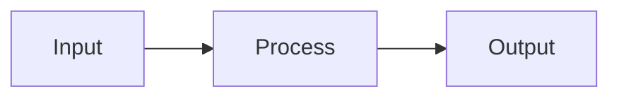

# Techniques, Rendering Pipelines, and Pitfalls

## Table of Contents

- [Prompt Engineering for Diagram Generation](#prompt-engineering-for-diagram-generation)
- [The Validation Loop](#the-validation-loop)
- [Multi-Modal Validation](#multi-modal-validation)
- [Direct CLI Rendering](#direct-cli-rendering)
- [Kroki: Universal Rendering API](#kroki-universal-rendering-api)
- [GitHub Markdown (Mermaid Only)](#github-markdown-mermaid-only)
- [Mermaid with ELK](#mermaid-with-elk)
- [CI/CD Integration](#cicd-integration)
- [Decision Tree: Picking the Right Tool](#decision-tree-picking-the-right-tool)
- [Common Pitfalls](#common-pitfalls)
- [Further Reading](#further-reading)

---

## Prompt Engineering for Diagram Generation

When delegating diagram generation to a sub-agent, be explicit about format and constraints:

```
Generate a Mermaid flowchart (top-to-bottom) showing the user authentication flow.
Rules:
- Use exactly 4-5 nodes
- Use TB direction
- Label all edges
- Use subgraph blocks to group related steps
- Do not use special characters in labels (no colons, parentheses, or quotes)
```

Key principles:
- **Specify node budget.** Without it, diagrams tend to over-elaborate to 10–15 nodes. "4–5 nodes" forces appropriate abstraction.
- **Pin the diagram type.** "Create a Mermaid sequence diagram of X" produces better results than "create a diagram of X."
- **Provide an example** of the desired syntax and style when possible. Few-shot prompting works well for diagram generation.

---

## The Validation Loop

Generate → validate → fix is the most reliable pattern for correct diagram output:

1. **Generate** diagram code.
2. **Validate** by rendering with the appropriate CLI command (see the workflow in SKILL.md).
3. **Fix** — if errors are found, read stderr and correct the code. Converges in 1–2 iterations.

## Multi-Modal Validation

If vision is available, close a stronger feedback loop:

1. Generate diagram code.
2. Render to PNG.
3. Inspect the image: "Is this readable? Are there crossing arrows that could be eliminated? Does it accurately represent the intended content?"
4. Iterate by reordering node declarations or restructuring the code.

This catches semantic errors (wrong relationships, missing nodes) and layout problems that syntax validation misses.

---

## Direct CLI Rendering

| Tool | Install | Render Command |
|---|---|---|
| Mermaid | `npm install -g @mermaid-js/mermaid-cli` | `mmdc -i input.mmd -o output.svg` |
| D2 | `brew install d2` or binary from GitHub | `d2 input.d2 output.svg` |
| Graphviz | `brew install graphviz` / `apt install graphviz` | `dot -Tsvg input.dot -o output.svg` |
| PlantUML | Download JAR + Java runtime | `java -jar plantuml.jar -tsvg input.puml` |

## Kroki: Universal Rendering API

[Kroki](https://kroki.io) is a unified rendering server supporting 20+ diagram languages (Mermaid, D2, Graphviz, PlantUML, Structurizr, Excalidraw, etc.). One API endpoint for all diagram types — no need for multiple CLI tools.

**Self-host:** `docker run -p 8000:8000 yuzutech/kroki`

**Usage:**

```bash
curl -X POST https://kroki.io/mermaid/svg \
  -H "Content-Type: text/plain" \
  -d 'flowchart TB
    A --> B --> C' \
  -o diagram.svg
```

Or embed via GET with base64-encoded content:

```markdown

```

## GitHub Markdown (Mermaid Only)

GitHub renders Mermaid blocks natively — zero infrastructure:

````markdown

````

Tradeoff: locked to Mermaid with Dagre layout (no ELK), no control over output format.

## Mermaid with ELK

When the renderer is controlled and `@mermaid-js/layout-elk` can be installed, register it programmatically:

```javascript
import mermaid from 'mermaid';
import elkLayouts from '@mermaid-js/layout-elk';
mermaid.registerLayoutLoaders(elkLayouts);
```

Then use the `config: layout: elk` header shown in the SKILL.md tool selection section.

**Caveat:** ELK output differs from GitHub's Dagre rendering. For cross-platform consistency, either commit rendered SVGs or use Dagre everywhere.

## CI/CD Integration

Render diagrams in CI for documentation-as-code workflows:

```yaml
# GitHub Actions example
- name: Render diagrams
  run: |
    npx @mermaid-js/mermaid-cli -i docs/diagrams/*.mmd -o docs/diagrams/
    # Or with D2:
    for f in docs/diagrams/*.d2; do
      d2 "$f" "${f%.d2}.svg"
    done
```

Commit rendered SVGs alongside source files so diagrams are viewable even without tool support.

---

## Decision Tree: Picking the Right Tool

```
Where will this diagram be viewed?
│
├─► GitHub/GitLab Markdown (must render natively)
│   └─► Mermaid
│       ├─ Flowchart, state, ER, sequence, class → Mermaid handles well
│       └─ Needs better layout → Render locally with ELK, commit SVG
│
├─► Docs site / PDF / standalone SVG
│   │
│   ├─ UML sequence diagram → PlantUML
│   ├─ Architecture / containers → D2
│   ├─ Directed graph / dependencies → Graphviz dot
│   ├─ Network / knowledge graph → Graphviz neato or fdp
│   ├─ ER diagram → Mermaid erDiagram or D2 sql_table
│   ├─ State machine → Mermaid stateDiagram-v2 or PlantUML
│   └─ Multiple types in one project → Kroki
│
└─► Multiple formats / mixed toolchain
    └─► Kroki (unified API, self-hostable, 20+ languages)
```

---

## Common Pitfalls

**Over-elaboration.** Asking for "a diagram of the authentication flow" produces 12 nodes. Fix: always specify a node budget ("3–5 nodes, happy path only"). Add edge cases as separate diagrams.

**Wrong direction.** A top-to-bottom flowchart rendered left-to-right. Fix: specify direction in both the prompt and the code (`flowchart TB`, `direction: down`, `rankdir=TB`).

**Wrong diagram type.** Service interactions drawn as a flowchart instead of a sequence diagram. Fix: if the diagram shows interactions between actors over time, use a sequence diagram; if it shows a decision process, use a flowchart.

**Positional instructions.** "Place the database at the bottom" causes the LLM to encode hints the layout engine ignores. Fix: use structural instructions: "The database should be at the lowest layer of the dependency chain."

**Unvalidated output.** Subtle syntax errors go unnoticed until rendering. Fix: always render before committing. In CI, fail the build on rendering errors.

---

## Further Reading

### Layout Algorithms
- [Diagram layout engines: Minimizing hierarchical edge crossings](https://terrastruct.com/blog/post/diagram-layout-engines-crossing-minimization/) — crossing minimization in TALA
- [ELK Layered Algorithm Reference](https://eclipse.dev/elk/reference/algorithms/org-eclipse-elk-layered.html)
- [ELK Layout Options Reference](https://eclipse.dev/elk/reference/options.html)
- [Drawing graphs with dot (Graphviz Guide)](https://graphviz.org/pdf/dotguide.pdf) — edge weight tricks and rank constraints
- [Graphviz edge-crossing examples](https://renenyffenegger.ch/notes/tools/Graphviz/examples/edge-crossing)

### Tool Comparisons
- [text-to-diagram.com](https://text-to-diagram.com/) — side-by-side rendering comparison
- [D2 FAQ: Comparison with other tools](https://d2lang.com/tour/faq/)

### LLM + Diagram Research
- [How well will LLMs perform for graph layout tasks?](https://www.sciencedirect.com/science/article/pii/S2468502X25000683)
- [DiagramEval: Evaluating LLM-Generated Diagrams via Graphs](https://arxiv.org/html/2510.25761v1) — EMNLP 2025
- [DiagrammerGPT: Generating Diagrams via LLM Planning](https://arxiv.org/html/2310.12128v2)

### Tools
- [Kroki](https://kroki.io/) — unified rendering API
- [D2 Documentation](https://d2lang.com/)
- [Mermaid Documentation](https://mermaid.js.org/)
- [ELK Live Playground](https://rtsys.informatik.uni-kiel.de/elklive/)
- [Structurizr DSL](https://docs.structurizr.com/)

### Practical Guides
- [Agent Mermaid reporting for duty](https://blog.korny.info/2025/10/10/agent-mermaid-reporting-for-duty)
- [Revisiting Mermaid.js for simple diagrams](https://blog.korny.info/2025/03/14/mermaid-js-revisited) — includes ELK integration tips
- [Advanced Claude Code techniques: Mermaid diagrams](https://www.lennysnewsletter.com/p/advanced-claude-code-techniques-context)
- [Automate Technical Diagrams with LLMs using Mermaid, PlantUML and CI/CD](https://cosmo-edge.com/automate-technical-diagrams-llm-mermaid-plantuml-cicd/)
